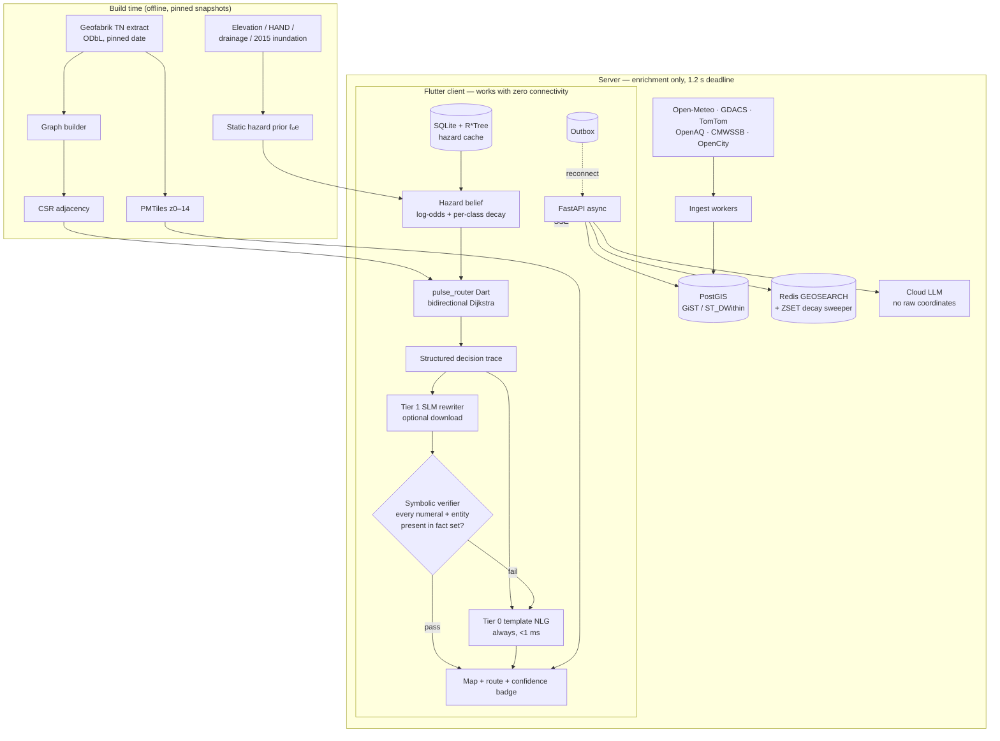

# Architecture

The system as it is to be built. Where this disagrees with the pitch deck, this file wins.
Decisions and their reasoning are in `docs/DECISIONS.md`.

## Principle

**Offline-first, not offline-fallback.** The client always computes the route locally. The
network, when present, enriches within a deadline. Nothing the user needs in an emergency
depends on connectivity.

## Diagram

## Components

### `packages/pulse_router` (Dart)
The single routing implementation. CSR adjacency, bidirectional Dijkstra (the ALT landmark
module exists but is **not on the query path**, KNOWN_FLAWS F-11), mutable per-edge hazard array, cost function per ADR-003. Emits a **structured
decision trace** — the chosen route, the rejected alternatives, and for each avoided edge the
hazard class, posterior `p̄`, evidence count `n_eff`, report age, and the resulting time
penalty. The trace is the sole input to both explanation tiers and the sole thing the
verifier checks against.

AOT-compiled to a CLI so the Python evaluation harness runs *exactly the code the app runs*.

### `packages/pulse_belief` (Dart)
Hazard belief state: log-odds fusion, per-class decay constants `T_c`, spatial kernel `κ`,
`n_eff` accounting, and the pessimistic plug-in `p̃`. Kept separate from the router so the
calibration study can evaluate it standalone against held-out Chennai closure data.

### `app/` (Flutter)
MapLibre GL Native via `maplibre_gl`, PMTiles from local storage (native `pmtiles://` on
Android and iOS). SQLite via Drift with the built-in R*Tree module for the hazard cache —
not SpatiaLite, not Isar. Outbox table for pending reports.

### `server/` (FastAPI)
Async ingest workers per feed, PostGIS with GiST indexes for spatial queries, Redis
`GEOSEARCH` for hot hazard lookup with a parallel ZSET sweeper for decay (Redis cannot expire
individual geo-set members), SSE for pushing new hazards to connected clients. The cloud LLM
path receives the decision trace with place names only — never raw coordinates (ADR-007).

### `scripts/` + `data/results/`
Every experiment is a seeded script writing to a dated results directory. Nothing enters the
paper without a script that reproduces it.

## Storage budget (Chennai metropolitan area)

| Item | Size | Basis |
|---|---|---|
| Routing graph (CSR + ALT) | ~15–22 MB | estimate, from measured 1.0–1.5× PBF ratio |
| PMTiles basemap z0–14 | ~35–50 MB | estimate |
| Gemma 3 270M Q4_K_M | **253 MB** | measured |
| Hazard cache (live / 7-day) | ~3 MB / ~14 MB | estimate |
| App binary | ~40–70 MB | typical Flutter + MapLibre |
| **Total with model** | **~350–420 MB** | |
| **Total without model** | **~100–170 MB** | |
| All Tamil Nadu | ~750 MB–1 GB | estimate |

The routing graph is the *smallest* line item. Tiles and the model dominate — hence template
NLG as the shipped baseline and the SLM as an optional download (ADR-004, ADR-005).

## What this architecture does not do

It does not know live street-level water depth. No obtainable source provides "this lane is
40 cm deep right now" for Chennai. Every live flood signal available to us is either ≥5 km
grid (GloFAS / IMERG) or a static historical prior. **The honest framing, which must appear
in the paper and the demo: CityPulse fuses a high-resolution static hazard prior with coarse
live forcing and user reports — it is not a live high-resolution flood sensor network.**
