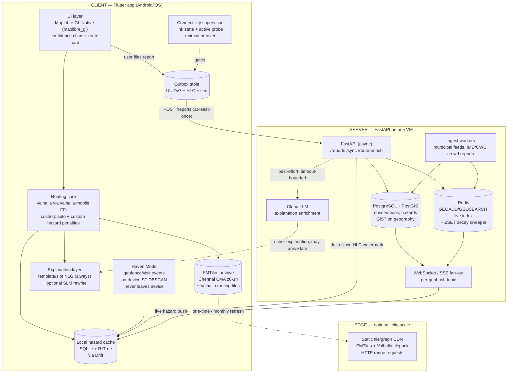

# Strand F — Offline-First Systems Engineering & the Geospatial Stack

**Research Agent F · CityPulse AI · 2026-09-12**
Scope: the concrete buildable architecture — on-device routing, offline tiles, local
spatial storage, sync/conflict resolution, connectivity degradation, background
location, on-device place learning, and the server side.

Convention used throughout: numbers taken from a cited source are marked
**[measured]**; numbers I derived are marked **[estimate]** with the derivation shown.
No API, library or paper is cited here that I have not opened or verified as live
during this session; where I only confirmed existence rather than reading in full,
the claim attached to it is limited to what the page title/abstract supports.

---

## 0. Executive summary — the one-paragraph architecture

Build **offline-first, not offline-fallback**. The client should always compute a
route locally from a pre-cached Valhalla tileset plus a local hazard cache, and treat
the cloud as an *enrichment and corroboration* channel that upgrades the answer when
it arrives in time. This inverts the pitched design (online-by-default, switch on
disconnect) and removes the single most fragile claim in the deck — the "millisecond"
failover — by making failover a no-op. Routing engine: **Valhalla via `valhalla-mobile`
(Rallista) / Ferrostar**, not GraphHopper and definitively not OSRM. Rendering:
**MapLibre GL Native via `maplibre_gl` Flutter plugin**, tiles as a **PMTiles** archive
on local storage. Local store: **SQLite (via Drift) with the built-in R\*Tree module**
for the hazard cache plus an **outbox** table. Sync: **append-only, client-UUID-keyed
observation log (a G-Set CRDT) with idempotent replay**, HLC-stamped; *no* LWW on
hazard facts, LWW-Register only for user preferences. Server: **FastAPI + PostGIS
(GiST) + Redis geo index + WebSocket fan-out**.

---

## 1. Recommended architecture



**The load-bearing property of this diagram**: every arrow from CLIENT to SERVER is
dashed-or-optional in the sense that no user-visible function blocks on it. The route
is produced by `RT` reading `TILES` + `HC`. The server only ever *improves* what is
already on screen.

---

## 2. On-device routing

### 2.1 GraphHopper — do not use for the mobile side

GraphHopper's Android offline support is effectively end-of-life. In the project's own
"Future of 'Offline' Routing" issue the maintainer states Android support was only
"okayish", describes a per-process virtual memory limit that restricted loading large
graphs, notes Android builds were failing on CI with no fix, and says supporting it
forced the core to stay on Java 7 and avoid dependency updates. The conclusion was that
absent contributors, "we'll have to go for option 1 and drop explicit support for
Android offline routing" ([graphhopper#1940]). The commonly-cited `graphhopper-android`
demo is a third-party fork, not a maintained artifact. **[measured, from maintainer
statements]**

GraphHopper remains a fine *server-side* engine. If the team wants one engine on both
sides, that argues for Valhalla, not GraphHopper.

### 2.2 OSRM — not a mobile option at all

OSRM is a C++ *server*. It has no Android/iOS build artifact, its CH/MLD preprocessing
is a heavyweight offline pipeline, and its datastore is memory-mapped for server-class
RAM. Nothing in the OSRM project targets a handset. The brief's "OSRM or GraphHopper"
should be read as a server-side choice only. Additionally, OSRM's contraction-hierarchy
mode bakes edge weights into the preprocessed graph, which is exactly wrong for
**dynamic per-request hazard penalties** — you would be forced into MLD mode anyway.

### 2.3 Valhalla — the recommended engine, both sides

Valhalla is the right pick for three independent reasons:

1. **Tiled graph by design.** Valhalla's graph is a hierarchical tile pyramid, so a
   city-scale subset is a natural artifact rather than a hack. The maintainers'
   recommended mobile workflow is exactly this: generate tiles server-side, ship the
   pre-generated tileset to the app, and point a Valhalla config at it — "the mobile
   app wouldn't consume the OSM data and generate tiles; it would just need a valhalla
   config that points it at the pregenerated tiles" ([valhalla#4746]). On-device tile
   *generation* is explicitly discouraged (needs admin DBs, timezone data, elevation
   tiles). **[measured]**
2. **Dynamic costing at request time.** Valhalla applies costing at query time, not at
   preprocessing time. This is what makes "penalise this edge because there is a
   2-minute-old flood report on it" possible without rebuilding a graph. This is the
   single most important architectural fact for CityPulse and it is the reason to
   prefer Valhalla over a CH-based engine.
3. **Real mobile builds exist.** [`Rallista/valhalla-mobile`] ships iOS and Android
   builds of Valhalla (Swift Package + Android artifacts), with
   [`valhalla-mobile-rs`] as the next-generation Rust/FFI replacement for the manual
   JNI + Objective-C++ layer. Stadia Maps' [Ferrostar] is a cross-platform navigation
   SDK in Rust that can drive either a remote Valhalla or a local one.

**The one real integration risk**: there is no first-party *Flutter* binding. Valhalla
on Flutter is an open request on the Rallista tracker ([valhalla-mobile#40]). The team
would need to write a thin Dart FFI / platform-channel wrapper around the Android
(`.aar`/JNI) and iOS (XCFramework) artifacts exposing one method: `route(json) ->
json`, since Valhalla's mobile API surface is the same JSON request/response as the
HTTP API ([Valhalla route API docs]). Budget **5–8 engineer-days** for this wrapper
**[estimate]**; it is the highest-variance task in the whole build and should be spiked
in week 1, not week 5.

### 2.4 A custom graph as the de-risked fallback

If the FFI spike fails, the fallback that still satisfies the novelty claim is a
**custom bidirectional A\* over a pruned local graph in pure Dart**, loaded from a
pre-built binary blob. For the Chennai drivable network this is genuinely tractable:
CSR-encoded adjacency (u32 node ids, u32 edge targets, u16 weights) over roughly
250k–400k drivable edges is ~4–6 MB in RAM **[estimate: 400k edges × ~12 bytes +
node offsets]**, and a single A\* query over a city graph is low-tens-of-milliseconds
in a compiled language. Dart AOT will be several times slower but still well inside a
200 ms budget. This gives you dynamic hazard penalties trivially (they are just a
weight function) at the cost of no turn restrictions, no real turn-by-turn instructions
and no map-matching. Recommend: **spike Valhalla first, hold the custom graph as the
week-4 contingency.**

### 2.5 Routing graph storage sizes

The anchor number: Valhalla maintainer nilsnolde states the graph is
**"~1 – 1.5 × OSM PBF size (currently around 75 GB planet graph)"**, with elevation
adding ~350 GB on top ([valhalla#3661]) **[measured]**. Elevation is optional and
should be **excluded** — it is the single biggest avoidable cost and CityPulse has no
use for it.

Geofabrik's India page gives **[measured, 2026-09-11]**: `india-latest.osm.pbf` = **1.6
GB**; Southern Zone = **531 MB**; Central 334 MB, Eastern 235 MB, Northern 212 MB,
Western 209 MB, North-Eastern 104 MB ([Geofabrik India]).

Southern Zone covers Tamil Nadu, Kerala, Karnataka, Andhra Pradesh, Telangana and
Puducherry. Tamil Nadu is ~130,000 km² of a ~635,000 km² zone but is more densely
mapped than average for the zone, so I take ~25% of the zone: **TN ≈ 130 MB PBF
[estimate]**. Chennai Metropolitan Area (~5,900 km², very densely mapped) I take at
~15% of TN: **Chennai CMA ≈ 20 MB PBF [estimate]**.

Applying the 1.0–1.5× ratio, and then discounting ~30% for building auto-only costing
without pedestrian/bicycle/transit hierarchies **[estimate]**:

| Region | OSM PBF | Valhalla tiles (all modes) | Valhalla tiles (auto-only, no elevation) |
|---|---|---|---|
| Chennai CMA | ~20 MB [est] | 20–30 MB [derived] | **~15–22 MB [est]** |
| Tamil Nadu | ~130 MB [est] | 130–195 MB [derived] | **~90–140 MB [est]** |
| Southern Zone | 531 MB [measured] | 530–800 MB [derived] | ~370–560 MB [est] |

**Conclusion: a Chennai routing graph is ~20 MB. This is a non-problem.** Even all of
Tamil Nadu at ~120 MB is an acceptable one-time download on Indian mobile data. The
deck's implicit worry about graph size is misplaced; the real constraints are tiles
and the model.

---

## 3. Offline map rendering and tiles

### 3.1 Format: PMTiles, not MBTiles

**MBTiles** is a SQLite container — fine, widely supported, but it means a second
SQLite file, a custom tile-provider shim, and no HTTP-range story for incremental
refresh. **PMTiles** is a single immutable archive addressable by HTTP range request
([protomaps/PMTiles]), which gives you one artifact that works identically as (a) a
bundled asset, (b) a file downloaded to app storage, and (c) a remote file served
from static hosting with only the needed tiles pulled. For a project that wants
"cache Chennai now, add Coimbatore later", that single-format story is worth a lot.

MapLibre handles `pmtiles://` **natively on Android and iOS** in the Flutter plugin —
no extra code; only Web needs a one-time protocol registration ([MapLibre Flutter
PMTiles docs]) **[measured]**. The same docs give an important practical warning: a
PMTiles file bundled as a *Flutter asset* has "a practical limit of around 50 MB".
Above that, download to app-support storage at first run instead of bundling.

Caveat to state plainly in the report/paper: a *remotely hosted* PMTiles archive is
still read over the network. True zero-connectivity requires the archive to be on
local storage (or MapLibre's Offline Regions API).

### 3.2 Tile size budget

Anchor: the Protomaps daily planet basemap (z0–15) is **~120 GB**, and "each
additional zoom level roughly doubles the size of the file" ([Protomaps downloads])
**[measured]**. That doubling rule is the key lever: **cap at z14**, which halves the
archive versus z15 and is more than enough for vehicle navigation (z14 tile ≈ 2.4 km
across at the equator; label/geometry detail at z14 is adequate, with symbol placement
handled by the style at higher visual zoom via overzooming).

Derivation for Chennai CMA **[estimate]**: at z14 a tile is 40,075/2^14 ≈ 2.45 km wide,
so ~6 km² per tile; 5,900 km² of CMA ≈ 980 z14 tiles. Summing the pyramid
(×4/3) ≈ 1,300 tiles. Dense-urban vector tiles from an OSM basemap run ~20–60 KB
compressed; at 40 KB average → **~52 MB**. Trimming layers CityPulse does not render
(POI classes, landuse detail, 3D building extrusions) plausibly gets this to **35–50
MB**.

Derivation for Tamil Nadu **[estimate]**: 130,058 km² ≈ 21,600 z14 tiles, ×4/3 ≈ 28,800;
mostly rural at ~8 KB/tile with ~8% urban at ~40 KB → ~28,800 × 10.5 KB ≈ **300 MB**,
call it **300–450 MB**.

These should be *verified by actually running `pmtiles extract`* against the Protomaps
daily planet before any number goes in the paper — the extraction is cheap and takes
minutes, and it converts two estimates into two measurements.

### 3.3 Flutter map package assessment

| Package | Renderer | Offline story | Maturity verdict |
|---|---|---|---|
| **`maplibre_gl`** (maplibre.org, v0.27.1) | MapLibre GL **Native** (GPU, vector) | Offline Regions on Android + iOS; native `pmtiles://`; MBTiles workable | **Recommended.** Verified publisher, Android API 21+/iOS 13+, no API key. Offline regions explicitly *not* supported on Web. ([pub.dev/maplibre_gl]) **[measured]** |
| `flutter_map` (+ vector tile plugins) | Dart/Flutter canvas | Raster MBTiles via community plugins; vector tiles via third-party packages with isolate decoding | Pure-Dart, easiest to debug, but vector rendering is a community reimplementation, not MapLibre's battle-tested GL pipeline. Acceptable for a **raster** fallback; not for a nav-grade vector map. |
| `mapbox_maps_flutter` | Mapbox GL Native | Mature offline | **Reject on principle for this project.** Requires a Mapbox account/secret token and is governed by proprietary terms; the deck's explicit positioning is "OSM-driven, no proprietary map infra." |

Known `maplibre_gl` limitations to design around **[measured, from the package page]**:
Flutter widgets cannot be placed *inside* the map (overlay in a `Stack`), feature state
is unavailable on iOS, no desktop targets, and the Android build needs JDK 21 /
Flutter 3.29+.

---

## 4. Local storage and spatial indexing on-device

### 4.1 Recommendation: SQLite + R\*Tree, accessed through Drift

**Use SQLite's built-in R\*Tree virtual-table module.** It is compiled into the SQLite
that ships with both Android and iOS, requires no extra native dependency, and is
purpose-built for exactly this: "a range query against an R\*Tree index is O(log N)"
versus a full scan ([SQLite R\*Tree docs]) **[measured]**. This is the correct primitive
for "give me every hazard whose bounding box intersects the corridor around my route."

**Do not use SpatiaLite.** It is a much larger native extension (GEOS, PROJ), adds
significant build friction on iOS, and CityPulse needs none of its topology/geometry
algebra. The queries are: points within a bbox, points within a radius, points near a
polyline. R\*Tree prefilter + Haversine refine in Dart covers all three.

**Drift vs ObjectBox vs Isar:**

- **Drift** — recommended. It is a typed layer *over* SQLite, so R\*Tree virtual tables
  remain reachable via `customStatement`/`customSelect`. Actively maintained, good
  migration story, and keeps the raw SQL escape hatch you will need.
- **ObjectBox** — has a real vector/geo story and is fast, but it is a separate native
  object store: you lose SQL, lose the R\*Tree module, and add a proprietary-ish
  runtime.
- **Isar** — was the fashionable choice; its maintenance has been unreliable and it has
  no spatial indexing at all. **Reject.**

### 4.2 Schema for time-stamped hazards

```sql
CREATE TABLE hazard (
  id            TEXT PRIMARY KEY,      -- UUIDv7, client-generated (time-ordered)
  kind          INTEGER NOT NULL,      -- flood / obstruction / closure / crowd ...
  lat           REAL    NOT NULL,
  lon           REAL    NOT NULL,
  observed_at   INTEGER NOT NULL,      -- epoch ms, when the world was observed
  received_at   INTEGER NOT NULL,      -- epoch ms, when this device learned it
  hlc           TEXT    NOT NULL,      -- hybrid logical clock stamp
  source        INTEGER NOT NULL,      -- 0=municipal 1=crowd 2=self
  confirmations INTEGER NOT NULL DEFAULT 0,
  refutations   INTEGER NOT NULL DEFAULT 0,
  severity      REAL    NOT NULL,
  edge_hint     INTEGER,               -- snapped Valhalla graph edge id, nullable
  payload       TEXT                   -- JSON, free-form
);
CREATE INDEX idx_hazard_time ON hazard(observed_at);
CREATE VIRTUAL TABLE hazard_rtree USING rtree(id_int, minLon, maxLon, minLat, maxLat);
```

Note `rtree` keys are integers, so keep a `id_int` surrogate (rowid) mapping to the
UUID. Query pattern for a route corridor:

```sql
SELECT h.* FROM hazard_rtree r JOIN hazard h ON h.rowid = r.id_int
WHERE r.maxLon >= ?1 AND r.minLon <= ?2
  AND r.maxLat >= ?3 AND r.minLat <= ?4
  AND h.observed_at > ?5;              -- drop anything past max TTL
```

Then apply **decay in the application layer, not in SQL**, because the decay function
is a product decision that will change weekly:

`weight = severity · exp(-(now - observed_at)/τ_kind) · trust(source, confirmations, refutations)`

with `τ_flood ≈ 45 min`, `τ_obstruction ≈ 20 min`, `τ_closure ≈ 6 h` **[estimate —
these are design parameters to be tuned, not findings]**. Crucially: **decay is a
display-and-cost weight, never a deletion criterion.** Deleting decayed hazards breaks
the "why did you route me this way an hour ago" audit trail that is the whole point of
the explanation feature.

Hazard cache size is trivial: at ~250 bytes/row plus R\*Tree overhead, **10,000 live
hazards ≈ 3 MB; 200,000 rows of 30-day history ≈ 55 MB [estimate]**. Cap history at
7 days on-device.

---

## 5. Sync and conflict resolution

### 5.1 The key insight: hazard reports are not mutable state

Most offline-sync pain comes from two devices editing the same mutable record. **That
situation does not exist for hazard reports.** "Pragatish observed water on Anna Salai
at 14:32" is an immutable historical fact. Two devices never edit it; they only both
*have* it or not. So the right data model is an **append-only observation log**, and
the right CRDT is the simplest one that exists: a **grow-only set (G-Set)**.

In Shapiro, Preguiça, Baquero & Zawirski's foundational paper, a G-Set is shown to be
a CvRDT whose merge is set union — union is commutative, associative and idempotent, so
convergence is automatic and no conflict resolution logic exists to get wrong
([Shapiro et al. 2011, *Conflict-free Replicated Data Types*, SSS 2011]). This is not
a compromise; it is strictly the strongest guarantee available, obtained for free by
choosing the right model.

### 5.2 The design

**Identity.** Every observation gets a **client-generated UUIDv7** at creation time.
UUIDv7 is time-ordered, so it doubles as a sort key and gives the server a natural
insertion order. Because the id is minted on-device before any network call, **replay
is idempotent by construction**: the server does `INSERT ... ON CONFLICT (id) DO
NOTHING`. At-least-once delivery plus idempotent handler = effectively-once, with no
distributed transaction anywhere.

**Ordering.** Stamp each observation with a **Hybrid Logical Clock** (Kulkarni,
Demirbas, Madappa, Avva, Leone, *Logical Physical Clocks*, OPODIS 2014). HLC gives a
monotonic, causally-consistent timestamp that stays close to physical time — which
matters here because the decay function is physical-time-based and a phone with a badly
skewed clock must not be able to inject a "2-minute-old" flood report that is actually
from yesterday. HLC bounds the damage; a pure Lamport clock would not, and raw
wall-clock would not.

**Transport: the outbox pattern.** A local `outbox` table written in the *same SQLite
transaction* as the hazard insert (Chris Richardson, [Transactional Outbox]). A
background worker drains it in `seq` order with exponential backoff. This is the
standard fix for the dual-write problem and is the reason a report survives the app
being killed mid-POST.

```sql
CREATE TABLE outbox (
  seq        INTEGER PRIMARY KEY AUTOINCREMENT,
  op_id      TEXT NOT NULL UNIQUE,   -- UUIDv7, == hazard.id for create ops
  op_type    TEXT NOT NULL,
  body       TEXT NOT NULL,
  hlc        TEXT NOT NULL,
  attempts   INTEGER NOT NULL DEFAULT 0,
  next_try_at INTEGER NOT NULL
);
```

**Delta sync inbound.** Client stores a per-server `hlc_watermark`. On reconnect:
`GET /sync?since=<hlc>&bbox=<cached area>` returns only observations with a greater
HLC. Watermark advances only after the batch commits locally. Plus a WebSocket
subscription for live push while connected. This is delta sync in the plain sense —
no state-vector exchange is needed because the log is totally ordered by HLC on the
server.

### 5.3 Per-datatype resolution policy

| Data | Model | Resolution | Why |
|---|---|---|---|
| Hazard observations | **G-Set** (append-only, UUIDv7) | Union; no conflicts possible | Immutable facts. Shapiro et al. CvRDT. |
| Confirm / refute votes | **2P-Set-ish**: `(hazard_id, user_id, sign)` tuples in a G-Set | Union, then count per hazard | A user's vote is itself an immutable observation; the counter is a *derived view*, so no counter CRDT is needed. |
| Hazard lifecycle (active/cleared) | **Server-derived**, never synced as mutable state | Server recomputes from the observation set + decay | Deliberately removes the only candidate for a genuine write-write conflict. |
| User prefs, Haven places | **LWW-Register** keyed by HLC | Last writer wins | Single-user, effectively never concurrent; LWW's known data-loss failure mode is acceptable here and nowhere else. |
| Route history / telemetry | Append-only local, opt-in upload | n/a | |

### 5.4 What *not* to use, and why

- **Automerge / Yjs.** Both are real, excellent, well-documented general-purpose CRDT
  libraries ([Automerge]), but they are designed for *collaborative mutable documents*.
  Bringing a full op-based JSON CRDT with a tombstone-bearing history into an app whose
  payload is an append-only event log adds metadata overhead and cognitive cost for
  zero benefit. Cite them in the paper as considered-and-rejected; do not ship them.
- **`sqlite_crdt` / `sql_crdt`** (cachapa, Dart, v3.0.4, verified publisher,
  [pub.dev/sqlite_crdt]). Genuinely relevant and Dart-native — these implement
  CRDT semantics over SQLite tables with HLC stamping. **Worth a look as a
  time-saver**, but they impose a specific table shape and a last-write-wins-per-field
  model, which is exactly the semantics section 5.3 argues against for hazards. Use
  the hand-rolled outbox + G-Set; optionally use `crdt`'s HLC implementation
  ([cachapa/crdt]) rather than writing your own clock.
- **PowerSync / ElectricSQL** ([pub.dev/powersync]). Production-grade Postgres↔SQLite
  sync engines with Flutter SDKs. If the goal were shipping a product in a month, this
  is the correct answer. For an academic project whose *stated novelty* is the
  offline/sync module, outsourcing that module to a managed service undercuts the
  contribution. Cite as the industrial baseline you are comparing against.

---

## 6. Connectivity detection and graceful degradation

### 6.1 Reality check on "the millisecond a connection drop is detected"

**This claim is not engineeringly sound as stated, and should be removed from the
deck.** Three separate reasons:

1. **There is no millisecond-granularity signal for most failures.** A phone can lose
   usable connectivity in at least four ways: (a) the radio link drops — the OS fires
   `ConnectivityManager.NetworkCallback.onLost` fairly promptly, on the order of
   hundreds of milliseconds to a couple of seconds, not one millisecond; (b) the device
   is attached to Wi-Fi with no upstream (captive portal / dead router) — the link state
   says CONNECTED and only an active probe reveals otherwise; (c) the cellular link is
   up but the path is congested and RTT climbs to 8 s — indistinguishable from a drop
   except by timeout; (d) the server is up but slow. Flutter's `connectivity_plus`
   documents this directly: it reports the *network interface* state and explicitly
   cannot guarantee actual internet reachability. Distinguishing (b)/(c)/(d) requires
   `internet_connection_checker_plus`-style active probing, which by definition costs
   at least one round-trip. **[measured, from package docs]**
2. **High latency ≠ loss of connectivity**, and conflating them is the most common bug
   in this class of app. A 6-second response that eventually arrives is not a
   disconnection; a system that flips to "OFFLINE MODE" on it will flap constantly on
   Indian mobile networks.
3. **Even a perfect detector would not help**, because the useful question is not "am I
   online?" but "will an answer arrive before the driver needs it?"

### 6.2 The fix: make failover a non-event

Replace detection-then-switch with a **deadline-bounded hedged request**:

```
t=0     compute local route from cached tiles + local hazard cache   (target < 200 ms)
t=0     fire cloud enrichment request with a hard 1200 ms deadline
t~150ms render the local route + template explanation + confidence badge
t<1200  if cloud answer returns, reconcile and animate the delta in;
        raise the confidence badge
t>1200  do nothing. The user already has a route. Badge stays at local confidence.
```

The user-visible latency to *a working route* is now bounded by local computation
only, and "the millisecond the connection drops" becomes literally true in effect —
because nothing was ever waiting on the connection. **This is a stronger claim than
the deck's, and it is defensible.** Reframe the slide as "offline-first: the route
never waits for the network" rather than "instant failover".

### 6.3 Supporting machinery

- **Timeouts, layered**: connect 2 s, total 1.2 s deadline for the route-enrichment
  path (yes, shorter than connect — the deadline governs), 10 s for background sync
  drain, 30 s for tile downloads. Never rely on a default.
- **Circuit breaker** (Nygard's pattern, as described by Fowler, [CircuitBreaker]):
  after N consecutive failures or deadline misses, open the breaker and stop issuing
  enrichment requests for a cooldown; half-open with a single probe. This is what
  stops a dead backend from costing battery and adding latency on every route. Suggest
  N=3, cooldown 30 s, exponential to 5 min **[estimate]**.
- **Three-state connectivity model**, not two: `ONLINE` (probe succeeded recently) /
  `DEGRADED` (interface up, probe slow or breaker open) / `OFFLINE` (no interface).
  The UI confidence badge maps to this, and *only* `OFFLINE` should ever say "offline".
- **Probe design**: probe your own `/healthz` with a 1 s timeout, at most once per
  15 s, and only when a request has already failed. Don't poll.

---

## 7. Background location, geofencing and battery

### 7.1 Android

Android 14+ requires a declared foreground-service *type*. For location you need
`FOREGROUND_SERVICE` + `FOREGROUND_SERVICE_LOCATION` in the manifest,
`android:foregroundServiceType="location"` on the service, at least one of
`ACCESS_COARSE_LOCATION`/`ACCESS_FINE_LOCATION` granted at runtime, and location
services enabled on the device — checked with `PermissionChecker.checkSelfPermission()`
before `startForeground(..., FOREGROUND_SERVICE_TYPE_LOCATION)`
([Android FGS types]) **[measured]**.

Two restrictions that directly constrain Haven Mode **[measured, same source]**:

- You **cannot start a location foreground service from the background** unless
  `ACCESS_BACKGROUND_LOCATION` has been granted. That permission requires a separate,
  second permission dialog that on modern Android routes the user to Settings to pick
  "Allow all the time" — real-world grant rates for this are low.
- Apps **targeting Android 15+ cannot launch a location foreground service from a
  `BOOT_COMPLETED` receiver at all**, regardless of permissions. So "Haven Mode resumes
  after reboot" needs the user to open the app, or needs to be geofence-driven.

Google's own documentation points at the alternative: "For location-triggered use
cases, consider using the Geofence API instead of a foreground service." That is the
right call.

**WorkManager is not a location sampler.** Its minimum periodic interval is 15 minutes
and it is subject to Doze/App Standby bucketing. Use it for *sync drain and tile
refresh*, not for tracking.

### 7.2 iOS

Apple's Energy Efficiency Guide is explicit about the hierarchy **[measured]**:
region/beacon monitoring and visit monitoring are cheapest, significant-change updates
are middling, and continuous standard updates at high accuracy are most expensive. The
guide warns that "significant-change location updates run continuously, around the
clock, until you stop them, and can actually result in higher energy use if not
employed effectively," and that requesting accuracy you don't need "causes Core
Location to power up additional hardware and waste power" ([Apple Location Best
Practices]). Their recommended default for coarse use is
`kCLLocationAccuracyThreeKilometers`.

### 7.3 Battery numbers and the Haven Mode design consequence

Order-of-magnitude figures for a modern mid-range phone, **[estimate]** — these must be
measured on a real device with Android's Battery Historian / Xcode Energy gauge before
any number goes into the paper:

| Mode | Typical drain | 12-hour cost on a 5000 mAh phone |
|---|---|---|
| Continuous GPS @ 1 Hz, high accuracy, screen off | ~120–200 mW | ~25–40% of battery |
| Significant-location-change / fused 5-min balanced | ~5–15 mW | ~1–3% |
| Geofence + visit monitoring only (event-driven) | ~1–5 mW | <1% |

**Design consequence: Haven Mode must never run continuous location.** Architect it as:
(1) high-rate location **only while actively navigating**, in a foreground service with
a visible notification, which the user has already accepted as the cost of navigation;
(2) between trips, **geofence + visit/significant-change events only**, feeding the
stay-point detector; (3) a hard cap of a few dozen geofences (Android's per-app
geofence limit is 100). This also happens to be far better for privacy and for
permission-grant rates.

---

## 8. Privacy-preserving on-device learning of meaningful places

### 8.1 Algorithm

The standard pipeline is **stay-point detection then clustering**. Stay-point detection
(the Zheng/Li GeoLife lineage) collapses a GPS trace into episodes where the user
remained within a distance threshold `D` for longer than a time threshold `T` —
typical parameters `D = 100–200 m`, `T = 20–30 min`. There is direct literature on
doing this entirely on the handset: *Full On-Device Stay Points Detection in
Smartphones for Location-Based Mobile Applications* (Sensors, 2016), which is exactly
the citation this strand needs. For the clustering step, *An Improved DBSCAN Algorithm
to Detect Stops in Individual Trajectories* (ISPRS IJGI 6(3):63, 2017) is the
appropriate reference; **ST-DBSCAN** (spatial + temporal eps) is the right variant
because it will naturally separate "the office on weekdays 09:00–18:00" from "the same
building's ground-floor café on Saturday."

Scale is trivially on-device: after stay-point extraction, a month of one user's
movement is on the order of **a few hundred stay points**, so DBSCAN's O(n²) worst case
is microseconds. There is no computational argument for doing this server-side.
**[estimate, derived from ~5–15 stays/day × 30 days]**

Labelling home/work is a heuristic on top of the clusters, not ML: home ≈ the cluster
with the most 00:00–05:00 dwell; work ≈ the top weekday 10:00–16:00 cluster. Show the
inferred labels to the user and let them correct or delete — which is both better UX
and the DPDP-compliant behaviour.

### 8.2 What is and isn't realistic for a 3-person, 7-week project

| Technique | Verdict |
|---|---|
| On-device stay-point + ST-DBSCAN, results never leave the device | **Do this.** Genuinely private, genuinely simple, and it is a real, citable technique. |
| Federated learning | **Do not attempt.** FL requires a fleet of participating clients, a secure aggregation server, and a training loop. With a demo-scale user base there is nothing to federate. Cite as future work. |
| Differential privacy | **Do not attempt to build.** But *do* apply the one DP-adjacent thing that is cheap and real: if you ever upload aggregate place statistics, snap to a coarse grid (e.g. ~500 m geohash-6) and suppress cells with fewer than k users (k-anonymity, k≥10). Describe it honestly as k-anonymised aggregation, not as differential privacy. |
| Local-only encryption at rest | **Do this** — SQLCipher or platform keystore-backed encryption on the places table. Cheap, real, demonstrable. |

### 8.3 DPDP Act 2023 / DPDP Rules 2025 — high level

The Rules were notified **14 November 2025** with an **18-month phased compliance
timeline** ([PIB press release]) **[measured]**, so the obligations become live during
the plausible lifetime of this project. The relevant principles for CityPulse, from the
same source: consent must be via "standalone, clear and simple consent notices that
transparently explain the specific purpose"; the seven principles include **purpose
limitation, data minimisation and storage limitation**; data principals can demand
access/correction/erasure with a response inside **90 days**; and a breach requires
prompt plain-language notice to affected individuals.

Practical mapping for CityPulse:

- **Location traces are personal data.** Inferred home/work is arguably the most
  sensitive derivative. Keeping it on-device and never transmitting it is not just good
  practice — it is the cleanest possible compliance posture, because data you never
  collect as a Data Fiduciary creates no obligation.
- **Separate the consents.** Hazard reporting consent must be a distinct notice from
  Haven Mode location-learning consent. Bundling them is exactly what the "standalone"
  requirement targets.
- **Storage limitation** implies a documented retention policy: hazard observations
  server-side with a stated TTL, raw traces on-device with a rolling window (suggest
  30 days), derived place clusters retained until the user deletes them.
- **One-tap erasure** of all Haven data, satisfying the erasure right locally and
  instantly.

One correction to the deck's language: it says Haven Mode learns "from encrypted
everyday routing usage." **"Encrypted" is doing no work in that sentence** — data must
be decrypted to be processed, so encryption is not the privacy property being claimed.
The accurate and stronger claim is **"processed entirely on-device; never transmitted."**
Fix this wording; a reviewer will notice.

---

## 9. Backend

### 9.1 FastAPI

The controlling rule, from FastAPI's own concurrency documentation: a path operation
declared `async def` runs on the event loop and **must not block**; a path operation
declared with plain `def` is run in an external threadpool automatically
([FastAPI Concurrency]) **[measured]**. The failure mode to avoid is a routing or
geometry call (Shapely, a subprocess, a sync DB driver) inside an `async def` handler,
which stalls every other request on that worker.

Concretely for CityPulse:

- `asyncpg` (directly, or SQLAlchemy 2.x async) for all PostGIS queries — never
  `psycopg2` sync inside `async def`.
- `redis.asyncio` for the live geo index.
- Any CPU-bound geometry (buffering a route polyline, snapping to edges) goes through
  `run_in_threadpool` / `asyncio.to_thread`, or better, is pushed into PostGIS as SQL.
- If the server also runs a Valhalla instance, call it over HTTP with `httpx.AsyncClient`
  rather than embedding it.
- Use `lifespan` to hold the connection pools; do not open connections per request.

### 9.2 PostGIS

- Store positions as `geography(Point,4326)` so distance is in metres without
  reprojection, and index with **GiST**. For a Chennai-scale workload the volumes are
  small enough that index choice is not a bottleneck; correctness of the operator is.
- Use the **`<->` KNN distance operator** for "nearest hazards to this point" — it is
  index-assisted only when it appears in `ORDER BY` with one side constant
  ([PostGIS KNN docs], [PostGIS workshop ch. Nearest-Neighbour]) **[measured]**.
- Corridor queries (hazards near a route) are the common case: build the route
  linestring, `ST_DWithin(h.geog, route.geog, 150)`. `ST_DWithin` is index-assisted;
  `ST_Distance(...) < x` is not. This distinction is the single most common PostGIS
  performance mistake.
- Partition or at least index `observed_at`; most queries are `WHERE observed_at >
  now() - interval '2 hours'`.

### 9.3 Redis

Redis geo commands are the right tool for the **hot, recent** slice. `GEOADD`/
`GEOSEARCH` store members in a sorted set with a 52-bit geohash score; `GEOSEARCH`
supports `BYRADIUS` and `BYBOX`, with `COUNT`/`ASC`, at **O(N + log M)** where N is the
count in the grid-aligned bounding box ([Redis GEOSEARCH]) **[measured]**.

**Important gotcha for the deck's "Redis for decay calculations":** Redis TTLs apply to
*keys*, not to individual sorted-set members. You cannot `EXPIRE` one hazard out of a
geo set. **[measured — confirmed against the GEOSEARCH/GEOADD docs]** The working
pattern is:

1. `GEOADD hz:live <lon> <lat> <hazard_id>` for the spatial index.
2. `ZADD hz:exp <expiry_epoch> <hazard_id>` as a parallel expiry heap.
3. A sweeper task every 30 s: `ZRANGEBYSCORE hz:exp -inf <now>` → `ZREM hz:live ...` +
   `ZREM hz:exp ...`, in a Lua script or pipeline for atomicity.
4. Keep the *decay weight* out of Redis entirely — compute it at read time from
   `observed_at`, because it is a continuous function, not a threshold.

Alternatively shard by time bucket (`hz:live:<15min-bucket>`) and let whole keys expire
— simpler, at the cost of querying 4–8 keys per request. For a student project this is
the better trade.

### 9.4 Push: WebSockets vs SSE

- **WebSocket** if the client will ever send over the same channel (live position for
  server-side corridor subscription). FastAPI has first-class `WebSocket` support.
- **SSE** if push is strictly one-way — simpler, survives proxies better, auto-reconnects
  with `Last-Event-ID` which maps neatly onto the HLC watermark.

Recommendation: **SSE for the hazard feed** (one-way, and `Last-Event-ID` gives you
resumable delta sync for free), **WebSocket only if** live-position subscriptions are
built. Topic granularity: subscribe by **geohash-5 cell** (~5 km) around the user;
that bounds fan-out without needing a spatial pub/sub engine.

---

## 10. Reality check on the pitch's claims

| # | Claim from the deck | Verdict | Detail |
|---|---|---|---|
| 1 | "Fully functional routing with zero external connectivity" | **Sound, with a boundary** | True *within the pre-cached region*. ~20 MB of Valhalla tiles + ~40 MB PMTiles covers Chennai CMA. Must be stated as "within downloaded regions"; a route to a destination outside the cache fails. |
| 2 | "OSRM or GraphHopper" as the routing engine | **Not sound for mobile** | OSRM has no mobile build; GraphHopper's Android offline support is explicitly unmaintained per its own maintainer ([graphhopper#1940]). **Switch to Valhalla.** Additionally, OSRM's CH mode cannot take per-request hazard penalties — an architectural mismatch, not just a packaging one. |
| 3 | "Edge fallback the moment the connection drops" / "the millisecond a connection drop is detected" | **Not sound as stated** | No millisecond-granularity signal exists for the common failure modes (captive portal, stalled cellular, slow server). Reframe as **offline-first with deadline-bounded cloud enrichment** — which delivers a *better* guarantee and is honest. See §6. |
| 4 | "On-device model generates route geometry AND explanations" | **Half unsound** | A language model must not generate route geometry — geometry comes from graph search over the routing tiles. Conflating the two is a correctness claim a reviewer will attack. Correct framing: **the graph produces the route; the model verbalises it.** |
| 5 | "Quantized local model" is feasible on-device | **Sound, but constrain the output** | Gemma 3 270M at Q4_K_M is **253 MB** (vs ~540 MB F16) ([HF GGUF card]) **[measured]** — deployable. But a 270M model free-generating safety-critical text will hallucinate street names and hazards. Use **template/slot NLG as the always-available path**, with the SLM constrained to rewriting a filled template into fluent Tamil/English. Never let it emit a fact it wasn't handed. |
| 6 | "Dynamic confidence-decay scoring based on signal age" | **Sound and genuinely differentiating** | Cheap to implement, easy to demo, easy to evaluate. This is the most defensible novelty claim in the deck. Keep it front and centre. |
| 7 | "Reconcile local edge decisions with the central server" | **Sound, and simpler than implied** | Because reports are immutable, this is a G-Set union + idempotent replay, not a hard reconciliation problem. Don't over-engineer it into CRDT machinery you don't need. |
| 8 | "Redis for live signal buffering + decay calculations" | **Partly unsound** | Redis cannot expire individual geo-set members; needs the parallel-ZSET sweeper of §9.3. Decay itself should be computed at read time, not stored. |
| 9 | Haven Mode learns from "encrypted everyday routing usage" | **Wording is wrong** | Encryption is not the privacy property. Say **"computed on-device; never transmitted."** |
| 10 | Haven Mode's passive continuous learning | **Sound only if event-driven** | Continuous background GPS costs an estimated 25–40% of battery over 12 h and, on Android 15+, cannot even be restarted after reboot from `BOOT_COMPLETED` ([Android FGS types]). Must be geofence + visit-monitoring driven. |
| 11 | "Ingest predictive municipal hazard models (flooding, storm tracks, heat, AQI)" | **Feasibility unverified — flag to the team** | This strand did not verify the availability, licensing or latency of Chennai/TN municipal feeds, IMD or CWC APIs. That is a hard dependency for Haven Mode and should be checked in week 1. Do not assume it. |
| 12 | Federated learning / differential privacy for place learning | **Not realistic in 7 weeks** | No client fleet to federate over. Cite as future work; ship on-device-only clustering + k-anonymised aggregates. |
| 13 | Flutter as the client | **Sound, with one named risk** | `maplibre_gl` is mature and offline-capable ([pub.dev]). The risk is that there is **no Flutter binding for Valhalla** ([valhalla-mobile#40]) — a custom FFI wrapper is required. Spike this in week 1. |
| 14 | "Built for one city, designed for every city" | **Sound** | Both PMTiles extraction and Valhalla tile generation are parameterised by a bounding box. Porting to another city is a pipeline re-run, genuinely. |

---

## 11. Storage budget

Target device: a mid-range Android phone with 64 GB storage. All figures for the
**Chennai CMA** deployment unless noted.

| Component | Format | Size | Basis |
|---|---|---|---|
| Valhalla routing tiles — Chennai CMA, auto-only, no elevation | Valhalla v3 tilepack | **~15–22 MB** | **[estimate]** from 1.0–1.5× PBF ratio ([valhalla#3661]) applied to a ~20 MB Chennai extract, less ~30% for auto-only |
| Valhalla routing tiles — all Tamil Nadu | Valhalla v3 tilepack | **~90–140 MB** | **[estimate]**, same method on a ~130 MB TN extract |
| Vector basemap — Chennai CMA, z0–14 | PMTiles | **~35–50 MB** | **[estimate]**; ~1,300 tiles × ~40 KB; consistent with MapLibre's ~50 MB bundled-asset guidance **[measured]** |
| Vector basemap — all Tamil Nadu, z0–14 | PMTiles | **~300–450 MB** | **[estimate]**; ~28,800 tiles, mixed urban/rural |
| Vector basemap — Chennai, z0–15 | PMTiles | **~70–100 MB** | **[estimate]**; Protomaps: each zoom level ≈ doubles size **[measured]** |
| On-device SLM (Gemma 3 270M, Q4_K_M) | GGUF | **253 MB** | **[measured]** ([HF card]); F16 is ~540 MB |
| SLM runtime KV cache + working set | RAM | ~150–300 MB | **[estimate]** |
| Hazard cache — 10,000 live hazards | SQLite + R\*Tree | **~3 MB** | **[estimate]**; ~250 B/row + index |
| Hazard cache — 7-day rolling history (~50k rows) | SQLite + R\*Tree | **~14 MB** | **[estimate]** |
| Outbox + Haven places + prefs | SQLite | **< 1 MB** | **[estimate]** |
| Flutter app binary (release, arm64, with MapLibre + Valhalla native libs) | APK/IPA | **~40–70 MB** | **[estimate]** |
| **Chennai-only install, total** | | **≈ 350–420 MB** | |
| **Chennai without the SLM** (template NLG only) | | **≈ 100–170 MB** | |
| **All Tamil Nadu install, total** | | **≈ 750 MB – 1.0 GB** | |

**Reading of this table:** the routing graph — the thing the deck implicitly treats as
the hard part — is the *smallest* line item. The two real costs are **tiles** and **the
model**. Two consequences:

1. **Ship template-based NLG as the baseline and make the SLM an optional download.**
   A 253 MB model download is a meaningful install barrier in India, and templates
   cover the demo path deterministically. The SLM then becomes a demonstrable upgrade
   rather than a hard dependency — and the app still works if the SLM integration
   slips.
2. **Ship Chennai only; make TN an in-app region download.** ~400 MB is fine as an
   opt-in, hostile as a first-run requirement.

---

## 12. Build sequencing recommendation (weeks 1–7)

1. **Week 1 — de-risk the two spikes.** (a) Valhalla mobile FFI from Flutter: get one
   route out of an on-device tileset, no UI. (b) Verify the existence and terms of the
   municipal/IMD/CWC hazard feeds. Both are binary go/no-go gates; both are currently
   unknown-unknowns.
2. **Week 2** — PMTiles extract for Chennai, MapLibre rendering it from local storage
   with aeroplane mode on. Measure the actual archive size and replace the estimates in
   §11 with measurements.
3. **Week 3** — SQLite + R\*Tree hazard cache; decay scoring; hazard-aware Valhalla
   costing; the local route path end-to-end offline.
4. **Week 4** — outbox + G-Set sync + FastAPI/PostGIS/Redis server + SSE push.
   Contingency checkpoint: if the Valhalla spike failed, switch to the custom Dart A\*.
5. **Week 5** — the claimed novelty: confidence-aware offline routing + explanations.
   Templates first, SLM second.
6. **Week 6** — Haven Mode on geofence/visit events with on-device ST-DBSCAN.
7. **Week 7** — measurement (battery, latency, route quality vs an online baseline) and
   the demo. **Reserve real time for measurement** — a paper with measured numbers on a
   narrower system beats a broader system with estimated numbers.

---

## 13. Sources

All URLs below were opened during this research on 2026-09-12.

**Routing engines**
1. GraphHopper — "Future of 'Offline' Routing" (maintainer statement on Android support): https://github.com/graphhopper/graphhopper/issues/1940
2. Valhalla — "How would Valhalla be used on a mobile device?" (recommended pre-generated-tiles workflow): https://github.com/valhalla/valhalla/discussions/4746
3. Valhalla — "OSM Planet Data Required Disk Space" (graph ≈ 1–1.5× PBF; 75 GB planet graph; ~350 GB elevation): https://github.com/valhalla/valhalla/discussions/3661
4. Valhalla — "Official Support for Valhalla Build Artifacts for iOS and Android": https://github.com/valhalla/valhalla/discussions/4509
5. Rallista/valhalla-mobile — iOS and Android builds of Valhalla: https://github.com/Rallista/valhalla-mobile
6. Rallista/valhalla-mobile-rs — Rust/FFI next generation: https://github.com/Rallista/valhalla-mobile-rs
7. valhalla-mobile issue #40 — "Valhalla on Flutter" (no Flutter binding today): https://github.com/Rallista/valhalla-mobile/issues/40
8. Ferrostar (Stadia Maps) — cross-platform Rust navigation SDK, route providers: https://stadiamaps.github.io/ferrostar/route-providers.html
9. Valhalla route API reference: https://valhalla.github.io/valhalla/api/route/overview/

**Data and tiles**
10. Geofabrik India downloads — india-latest 1.6 GB, Southern Zone 531 MB (retrieved 2026-09-11): https://download.geofabrik.de/asia/india.html
11. Protomaps basemap downloads — planet ≈ 120 GB at z0–15; each zoom level ≈ doubles size: https://docs.protomaps.com/basemaps/downloads
12. protomaps/PMTiles — single-file tile archive format: https://github.com/protomaps/PMTiles
13. MapLibre Flutter — PMTiles support, native on Android/iOS, ~50 MB bundled-asset guidance: https://maplibre.org/flutter-maplibre-gl/advanced/pmtiles/
14. `maplibre_gl` on pub.dev — v0.27.1, Android 21+/iOS 13+, offline regions, limitations: https://pub.dev/packages/maplibre_gl
15. maplibre/flutter-maplibre-gl repository: https://github.com/maplibre/flutter-maplibre-gl

**On-device storage**
16. SQLite R\*Tree module (O(log N) range queries, built into SQLite): https://www.sqlite.org/rtree.html

**Sync and consistency**
17. Shapiro, Preguiça, Baquero, Zawirski — *Conflict-free Replicated Data Types*, SSS 2011 (G-Set, CvRDT/CmRDT): https://www.lip6.fr/Marc.Shapiro/papers/2011/CRDTs_SSS-2011.pdf
18. Kulkarni, Demirbas, Madappa, Avva, Leone — *Logical Physical Clocks* (HLC), OPODIS 2014: https://cse.buffalo.edu/tech-reports/2014-04.pdf
19. Richardson — Transactional Outbox pattern: https://microservices.io/patterns/data/transactional-outbox.html
20. Fowler — CircuitBreaker (Nygard's pattern): https://martinfowler.com/bliki/CircuitBreaker.html
21. Automerge — general-purpose CRDT library (considered, not recommended here): https://automerge.org/
22. `sqlite_crdt` (cachapa, Dart, v3.0.4): https://pub.dev/packages/sqlite_crdt
23. cachapa/crdt — Dart CRDT + HLC implementation: https://github.com/cachapa/crdt
24. `powersync` Dart package — industrial Postgres↔SQLite sync baseline: https://pub.dev/packages/powersync

**Connectivity**
25. `connectivity_plus` — reports interface state, not internet reachability: https://pub.dev/packages/connectivity_plus
26. `internet_connection_checker_plus` — active reachability probing: https://pub.dev/packages/internet_connection_checker_plus

**Platform / background location**
27. Android — Foreground service types, `location` requirements, background-start and Android 15 `BOOT_COMPLETED` restrictions: https://developer.android.com/develop/background-work/services/fgs/service-types
28. Android — Restrictions on starting a foreground service from the background: https://developer.android.com/develop/background-work/services/fgs/restrictions-bg-start
29. Apple — Energy Efficiency Guide for iOS Apps, Location Best Practices (energy hierarchy, accuracy guidance): https://developer.apple.com/library/archive/documentation/Performance/Conceptual/EnergyGuide-iOS/LocationBestPractices.html

**Place learning and privacy**
30. *Full On-Device Stay Points Detection in Smartphones for Location-Based Mobile Applications*, Sensors 2016: https://pubmed.ncbi.nlm.nih.gov/27754388/
31. *An Improved DBSCAN Algorithm to Detect Stops in Individual Trajectories*, ISPRS IJGI 6(3):63, 2017: https://www.mdpi.com/2220-9964/6/3/63
32. *Evaluating and Validating Stay Point Detection Algorithms with different GPS Log Intervals* (Procedia CS, 2024): https://www.sciencedirect.com/science/article/pii/S1877050924013310
33. PIB — Digital Personal Data Protection Rules, 2025 notified 14 Nov 2025, 18-month phased timeline: https://www.pib.gov.in/PressReleasePage.aspx?PRID=2190014&reg=3&lang=2

**Backend**
34. FastAPI — Concurrency and async/await (`async def` vs `def` threadpool semantics): https://fastapi.tiangolo.com/async/
35. Redis — GEOSEARCH (sorted-set/geohash storage, O(N+log M), BYRADIUS/BYBOX): https://redis.io/docs/latest/commands/geosearch/
36. Redis — GEOADD: https://redis.io/docs/latest/commands/geoadd/
37. PostGIS — KNN `<->` distance operator: https://postgis.net/docs/geometry_distance_knn.html
38. PostGIS workshop — Nearest-Neighbour Searching: https://postgis.net/workshops/postgis-intro/knn.html

**Model sizing**
39. Gemma 3 270M Q4_K_M GGUF — 253 MB (vs ~540 MB F16): https://huggingface.co/Durlabh/gemma-270m-q4-k-m-gguf

---

## 14. Open questions this strand could not close

1. **Actual Chennai/Tamil Nadu PBF sizes.** Geofabrik does not publish per-state Indian
   extracts below the zone level. The §11 figures for Chennai and TN are derived from
   the 531 MB Southern Zone by area/density reasoning. Resolve by running an `osmium
   extract` with a Chennai CMA bounding box — 10 minutes of work, converts two estimates
   into measurements.
2. **Measured Valhalla tile size for that extract**, and measured PMTiles size at z14.
   Same fix.
3. **Availability and licensing of Chennai/TN municipal hazard feeds, IMD and CWC APIs.**
   Haven Mode's "Forecast" step depends entirely on these and this strand did not
   verify any of them.
4. **Real battery measurements.** The §7.3 table is estimated. Battery Historian on one
   physical Android device for one 12-hour run would replace it with defensible data.
5. **Whether the Flutter↔Valhalla FFI wrapper is a 5-day or a 3-week task.** This is the
   dominant schedule risk and the only way to find out is the week-1 spike.
