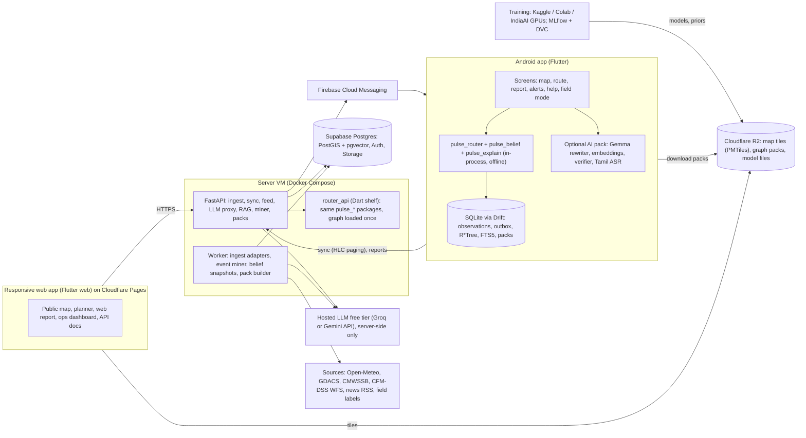

# PLAN.md — CityPulse AI build plan

**Purpose.** This is the plan for turning the CityPulse prototype into a working Android app, a responsive web app, a server and an ML pipeline. The plan includes every feature and AI/ML upgrade agreed so far. Any agent or teammate can pick up one task at a time from this file and finish it without needing a conversation history.

**Read first.** Read `CLAUDE.md` before this file. It explains what the project is, which results hold and which do not, and the safety rules. This file says *what to build next and how*. Where the two disagree, `CLAUDE.md` wins on facts and this file wins on the build order.

Last updated: 2 October 2026. Owner: Pragatish N (with Ravi and Jyotish). Budget: Rs 0 (free tiers only; exceptions are listed in Section 11).

---

## Contents

1. How to use this plan (agents start here)
2. What we are building, in one page
3. Architecture
4. Tech stack and why each choice is the best fit
5. Repository layout after the plan
6. Features: mobile app and web app
7. Data model and API contract
8. The AI and ML layer (models and RAG)
9. Milestones and tasks (M0–M8)
10. Testing, quality gates and definition of done
11. Budget: what is free, what is not, what to watch
12. Security and privacy rules
13. Risks and kill switches
14. Glossary of IDs

---

## 1. How to use this plan (agents start here)

### 1.1 Reading order

1. `CLAUDE.md` (all of it).
2. `00_START_HERE/KNOWN_FLAWS.md`: the flaw IDs (F-01 … F-23) used in the tasks below.
3. This file, Sections 1–5. Then go to the task you are working on in Section 9.

### 1.2 ID schemes (do not mix them up)

| Prefix | Meaning | Defined in |
|---|---|---|
| `M3.4` | A task in this plan: milestone 3, task 4 | This file, Section 9 |
| `F-07` | A confirmed flaw | `00_START_HERE/KNOWN_FLAWS.md` |
| `P0`–`P4` | Priority bands | `CLAUDE.md` §8 |
| `T5.1` and similar | Tasks from the **old** plan | `01_code/citypulse-IDP/docs/IMPLEMENTATION_PLAN.md` (history only; this file replaces it) |
| `ADR-0xx` | An architecture decision | `01_code/citypulse-IDP/docs/DECISIONS.md` |

### 1.3 How to pick and finish a task

1. Choose the lowest-numbered task whose **Status** is `TODO` and whose **Depends on** tasks are all `DONE`. A task marked **Human** needs a person; do not attempt it, but you may prepare its scripts or templates.
2. Set its status to `IN PROGRESS (agent/person, date)`.
3. Read every file listed under **Read first**.
4. Run the existing tests and write the baseline down (`CLAUDE.md` §9 step 3).
5. Do the **Steps**. Keep the change small. Every behaviour change gets a test that fails before and passes after.
6. Check every line of **Done when**. If one fails, the task is not done.
7. Set the status to `DONE (date, commit hash)`. If the task lists **Fixes F-xx**, mark that flaw `FIXED (date, commit)` in `KNOWN_FLAWS.md`.
8. Report back in the form of `CLAUDE.md` §9 step 8.

### 1.4 Hard rules for this plan (on top of `CLAUDE.md` §2)

- **One router implementation.** All routing goes through the Dart `pulse_router` package: in the app (in-process), in `services/router_api` (for the web and the harness), and in the CLI. Never port the algorithm to Python or JavaScript for production (ADR-001).
- **No new service, database or paid product** outside the stack in Section 4 without a new ADR in `docs/DECISIONS.md`.
- **No secrets in git or in any client.** API keys live in server environment variables only (F-16).
- **The system never says "safe".** It shows relative risk, the age of the evidence and "unknown" (ADR-011). This applies to every screen, notification, LLM output and API field.
- **No ML model ships to users** unless it beats its baseline on held-out labels, with the numbers written to `data/results/<date>-<name>/result.json` (Section 8.1).
- **Pin versions when you add them.** Versions are deliberately not pinned in this plan, because they change. When you add a dependency, pin the latest stable release from the official registry (pub.dev, PyPI, npm) and add a one-line comment with the date checked, as `app/pubspec.yaml` already does.
- **Anything marked "verify" is unconfirmed.** Free-tier limits, package support or model availability marked "verify" must be checked on the official page before you rely on it, and the check recorded in the task's report.

---

## 2. What we are building, in one page

CityPulse AI tells people in Chennai, during rain, **which streets have recent evidence of water, how old that evidence is, and how much longer a lower-risk route takes.** It works offline on cheap Android phones. It never claims a road is safe.

There are three products on one codebase:

| Product | Who uses it | What it does |
|---|---|---|
| **Android app** (Flutter) | Commuters, pedestrians, emergency drivers, field volunteers | Offline map with risk overlay; route planning for any origin and destination; reports by photo, voice (Tamil/English) or tap; alerts for saved places; offline helpdesk; field-label mode |
| **Responsive web app** (Flutter web) | The public on any browser; the team; partners and pilot buyers | Public map of the watchlist; route planner; web reports; ops dashboard (review queue, labels, model metrics, feed health); API docs |
| **Passability feed** (server API) | Fleets, insurers, traffic-data vendors (startup track, only after the 15 Oct gate) | Timestamped status for the 22 GCC subways and the 290 GCC waterlogging points, with age, confidence and an explicit "unknown" |

**What decides success is data, not features.** The milestone order reflects this. M0 builds the label pipeline before anything else, because a monsoon missed is a year lost.

---

## 3. Architecture

### 3.1 System diagram



### 3.2 The four design decisions that shape everything

1. **Offline-first on the phone, server-first on the web.**
   - The phone holds the graph, the hazard-edge prior and recent observations. It routes in-process with the same Dart packages the evaluation uses. A phone with no signal during a flood still gets a route and an honest "evidence is X hours old" (ADR-005).
   - A browser cannot reasonably hold the city graph. The web app asks `router_api`, which runs the same Dart code on the server. The router has one implementation and two runtimes.
2. **The router becomes a long-lived service.** `services/router_api` loads the graph once and answers in milliseconds instead of the CLI's 3 s per call (F-20). The Python harness switches to it, so studies can use thousands of origin–destination pairs instead of 100.
3. **Evidence flows one way: sources → observations → belief snapshot → clients.**
   - Every source (field labels, official feeds, news miner, crowd reports, traversal confirmations) becomes a row in one append-only `observations` table with `source`, `observed_at`, `received_at` and an HLC (ADR-008).
   - The worker computes a **belief snapshot** every few minutes during an event. A snapshot is the per-edge posterior for hazard edges only, versioned and small.
   - Phones pull the snapshot plus new observations since their last HLC (fixes F-10). The web and the feed read the same snapshot. Every client sees the same numbers.
4. **The language model never touches numbers or safety.**
   - The deterministic template (Tier 0) always produces the explanation.
   - An LLM may only *rephrase* it, using placeholders for every number and place, and its output passes the symbolic verifier plus an entailment check, or it is discarded (ADR-004, Section 8.5).
   - LLM keys stay on the server.

---

## 4. Tech stack and why each choice is the best fit

The criteria, in order: (1) runs offline on a Rs 10–15k Android phone; (2) keeps one router implementation; (3) costs Rs 0 for a student team; (4) the three of us can maintain it; (5) it is what the existing, tested code already uses, so no rewrite is wasted.

### 4.1 Clients

| Layer | Choice | Why it is the best fit here | Rejected, and why |
|---|---|---|---|
| Mobile + web framework | **Flutter (Dart)**, one codebase for Android and web | The router, belief and explanation packages are pure Dart with about 290 tests. Flutter runs them in-process on the phone with no bridge, and the same UI code builds for the web. The existing app shell is already Flutter. | **React Native / Expo:** would need the router rewritten in TypeScript or a native bridge, which breaks ADR-001. **Native Kotlin:** Android only, and the Kotlin prototype is a mock-up (F-22). **Next.js for the web:** a second UI codebase for a three-person team. |
| State and navigation | **Riverpod** + **go_router** | Riverpod gives testable, compile-safe state without `BuildContext` plumbing. go_router gives real URLs on the web (`/map`, `/route?from=&to=`, `/ops/review`) and deep links on Android from one route table. | Bloc: more boilerplate for the same result. Provider: superseded by Riverpod from the same author. |
| Responsive layout | **Material 3** with window-size classes: compact under 600 dp uses a bottom `NavigationBar`; medium (600–840 dp) and expanded (over 840 dp) use a `NavigationRail` with a side panel | One layout system covers phone, tablet and desktop browser. These are Material's own breakpoints, so behaviour is predictable. | A separate desktop UI: twice the screens to maintain. |
| Map | **MapLibre** (`maplibre_gl` Flutter plugin) with vector tiles. Online tiles come from **OpenFreeMap** (free, no API key; verify terms). Offline tiles are a **Protomaps PMTiles** extract for Chennai, stored on R2 and downloaded in the map pack. | Open source, no per-load fees, vector styling that can colour 14,534 hazard edges on the GPU, and the same engine on Android and web. PMTiles is a single static file, so it can be hosted on R2 with no tile server. | Google Maps SDK: needs billing, cannot work fully offline, and its licence restricts overlays on cached tiles. Mapbox: paid after the free tier. **flutter_map** is the fallback: pure Dart and simpler, but may be slower with thousands of polylines on a cheap phone. Task M0.9 measures both and picks. |
| Local database | **Drift over SQLite** (already in the app) with the **R*Tree** module for spatial lookups and **FTS5** for offline place search and helpdesk keyword search | Already implemented and tested (T5.2). SQLite is on every Android phone. R*Tree and FTS5 are compiled into `sqlite3_flutter_libs`. | Isar or Hive: no spatial index. SpatiaLite: heavy native build. |
| Vector search on the phone | **Brute-force cosine in Dart** over the helpdesk corpus (a few thousand chunks) | A few thousand embeddings scan in milliseconds, with no native extension to build. | **sqlite-vec:** right once the corpus passes about 50k chunks, but loading a custom SQLite extension in Flutter adds build risk now. Revisit later. |
| On-device LLM | **LiteRT-LM via `flutter_gemma`** (already a dependency). The default is the current Gemma 3 270M model. **Gemma 4 E2B (QAT)** is offered on phones with at least 6 GB RAM. | Google's supported on-device runtime with GPU and CPU back ends. The 270M model fits a Rs 10k phone; E2B gives better Tamil and English phrasing where memory allows. The template always works without either. | llama.cpp bindings: less mature in Flutter, no official Gemma 4 mobile path. Cloud-only LLM: fails offline, and keys would leak (F-16). |
| On-device speech | **sherpa-onnx** running **IndicConformer** (Tamil and English) int8 | Offline Tamil speech recognition at about 150–200 MB; sherpa-onnx has Flutter bindings. | Android's built-in speech recogniser: Tamil support needs Google services and a network connection on most budget phones. |
| Push notifications | **Firebase Cloud Messaging** | Free, works on Android and web push. | OneSignal: an extra vendor for no gain. |
| Crash reports | **Sentry** free tier (Flutter and Python SDKs) with location scrubbing | Shows real device failures from the field. | Firebase Crashlytics: fine too, but Sentry covers the Python server in the same dashboard. |

### 4.2 Server

| Layer | Choice | Why it is the best fit here | Rejected, and why |
|---|---|---|---|
| API server | **FastAPI (Python)**, the existing `server/` | It already has ingest, SSE events, storage adapters and tests. Python is where the geo and ML libraries are (GeoPandas, DuckDB, PyTorch, TRL). | Rewriting the server in Dart: loses the ML ecosystem and the existing adapters. Node: same problem. |
| Routing service | **`services/router_api`**: a small Dart **shelf** HTTP server wrapping `pulse_router` | Keeps one router implementation (ADR-001). Loads the graph once (fixes F-20). Serves both the web app and the Python harness. | Calling the CLI per request: 3 s per call. OSRM, Valhalla or GraphHopper: a second routing engine that does not know our cost model. |
| Database | **Postgres + PostGIS + pgvector** on **Supabase** free tier | The storage adapter already targets PostGIS. One database holds spatial data, the observation log, RAG vectors and API keys. Supabase adds Auth (anonymous sign-in), file Storage and a dashboard at no cost. | Firebase Firestore: no spatial joins or SQL, and weak for the evaluation queries. MongoDB: no PostGIS-grade geometry functions. |
| Live updates | **SSE** (already built) fed by **Postgres LISTEN/NOTIFY** | One fewer service. SSE works through proxies and in browsers. | **Redis** (in `requirements.txt`): only needed with several server instances. It stays optional, off by default. |
| Background jobs | One **worker** container running **APScheduler** jobs | The ingest adapters exist but are unscheduled. One process with a schedule table is easy to read and debug. | Celery: needs a broker. GitHub Actions cron: the fallback only, because it is not reliable to the minute. |
| LLM access (server) | One `LLMProvider` interface, backed by a hosted free tier (**Groq** or **Gemini API**; verify current free limits) | The event miner and the web helpdesk need a capable model. Keeping it behind one interface lets us switch providers when limits change, and a budget guard stops runaway use. | Self-hosting a 7B+ model: no free GPU that stays on. |
| Hosting | **Oracle Cloud Always Free** Arm VM (verify current shape and limits) running Docker Compose with **Caddy** for automatic HTTPS. Fallbacks: Google Cloud Run free tier, or Hugging Face Spaces (Docker). | An always-on VM with enough RAM to hold the graph in `router_api`. Compose keeps the server, router and worker together and identical to local development. | Render or Railway free tiers: sleep after inactivity, which is bad during a flood. Oracle sign-up sometimes rejects Indian cards; if it does, use Cloud Run. |
| Static web hosting | **Cloudflare Pages** (`*.pages.dev`, free) | Global CDN, free HTTPS, deploys from GitHub. | GitHub Pages: fine too, but single-page-app routing is clumsier. |
| Object storage | **Cloudflare R2** (verify current free allowance) | S3-compatible, and egress is free, which matters for map packs and model files that every phone downloads. | Supabase Storage: small free quota and paid egress; used only for report photos. |
| Geocoding | Local **gazetteer** first (FTS5 over OSM/Overture names, the 22 subways and the 290 points), then **Photon** or **Nominatim** through a server-side cache | Offline place search works in a flood. Public geocoders have fair-use limits (Nominatim: 1 request per second), so the server caches and rate-limits. | Google Places: paid and online-only. |

### 4.3 Data, ML and developer tooling

| Layer | Choice | Why |
|---|---|---|
| Python environment | **uv** with `pyproject.toml` and a lock file | One fast tool for venvs, installs and locking; the same command on Windows and Linux. Replaces bare `pip install -r`. |
| Dart workspace | **Pub workspaces** (root `pubspec.yaml` listing the packages, the app and `router_api`) | One `dart pub get` for everything, consistent versions, and no third-party tool needed. |
| Task runner | **Makefile** (fixed; F-19), run in **WSL2** or Git Bash on Windows | One command for every routine job: `make setup`, `make test`, `make dev`, `make study1`. |
| Local services | **Docker Compose**: `postgis/postgis` image with pgvector added, server, router_api, worker | The whole back end runs locally with one command and matches production. |
| Dev container | `.devcontainer/` for VS Code or GitHub Codespaces | Anyone, including a new teammate or an agent, gets a working environment without installing anything locally. Flutter Android builds stay on the host machine, where USB devices are available. |
| Large data and models | **DVC** with an **R2** remote | The graph (47 MB) and the prior (152 MB) exceed GitHub's 100 MB file limit. DVC versions them next to the code and keeps pinned snapshots immutable. |
| Experiment tracking | **MLflow** (local file store, synced to R2) | Free, no account, and every training run records its data version, parameters and metrics. |
| Geo processing | **DuckDB** with the spatial extension, **GeoParquet**, GeoPandas | Fast joins over OSM/Overture extracts on a laptop with no database server. |
| Training compute | **Kaggle** notebooks (free GPU quota; verify weekly hours), **Google Colab**, and the **IndiaAI compute portal** for larger runs (students eligible; verify current subsidy and approval rules) | Rs 0 for everything in this plan. Nothing needs a GPU to be always on. |
| Fine-tuning | **Hugging Face TRL + PEFT** (QLoRA), with **Unsloth** where it supports the model | Standard, well-documented tools for LoRA, QLoRA and GRPO on one free GPU. |
| CI | **GitHub Actions** | Free for public repositories and 2,000 minutes per month for private ones (verify). Runs analyse and test jobs for Dart, Flutter and Python; builds the APK and the web bundle. |
| Field data collection (now) | **KoboToolbox** or **ODK Collect** | Free, offline forms with GPS, timestamp and photo, usable from today, before our own field mode exists. |

---

## 5. Repository layout after the plan

The code lives in `01_code/citypulse-IDP/`. New folders are marked `NEW`. Existing paths do not move, so old documents and scripts keep working.

```
citypulse-IDP/
├── pubspec.yaml                 NEW  pub workspace root (lists the members below)
├── pyproject.toml               NEW  uv project for server/, scripts/, ml/
├── Makefile                          fixed (F-19)
├── .env.example                 NEW  every variable, no values
├── .devcontainer/               NEW
├── packages/
│   ├── pulse_router/                 + binary graph format, ALT on the query path
│   ├── pulse_belief/                 + Beta-quantile index, event gate
│   ├── pulse_explain/                + placeholder rewriter contract, stronger verifier
│   └── pulse_schema/            NEW  shared Dart models for API JSON (observation, snapshot, route)
├── app/                              Flutter app: Android + web (one codebase)
│   └── lib/src/
│       ├── features/            NEW  one folder per feature (map, route, report, alerts, help, field, ops, settings)
│       ├── platform/            NEW  offline routing (mobile) vs router_api client (web)
│       └── …                         existing data/, storage/, sync/, explain/ (refactored into features over time)
├── services/
│   └── router_api/              NEW  Dart shelf server around pulse_router
├── server/                           FastAPI (existing) + new routers: route, feed, packs, helpdesk, llm, labels, miner
├── ml/                          NEW  one folder per model: event_miner/, prior_v2/, photo/, belief_gnn/,
│                                     explain_grpo/, helpdesk_rag/, asr_eval/, forecast_gate/
├── infra/                       NEW  docker-compose.yml, Caddyfile, db/migrations/*.sql, deploy scripts
├── .github/workflows/           NEW  ci.yml, deploy-web.yml, build-apk.yml
├── scripts/                          existing harness (switches to router_api in M2.3)
├── config/                           hazard_classes.yaml and new watchlist.yaml
├── data/                             pinned snapshots (DVC-tracked; never edited in place)
└── docs/                             ADRs, contracts; IMPLEMENTATION_PLAN.md marked historical
```

---

## 6. Features: mobile app and web app

### 6.1 Principles for "easy to use for anyone"

- **Plain words, not probabilities.** Show "Water reported here 2 h ago (3 reports)" and "Lower-risk route: 6 min longer". Numbers appear in a detail view only.
- **Every status has an age and can be "unknown".** Grey means no recent evidence. Grey is not green.
- **Never "safe".** Use "lower risk" and "no recent reports". The disclaimer gate stays (ADR-011).
- **Three taps to report.** Open, choose photo, voice or quick tap, then send. Works offline; the outbox syncs later.
- **Tamil and English** from day one (`flutter_localizations`, ARB files). Voice input in both.
- **Built for a Rs 10k phone:** touch targets of at least 48 dp; text that scales to 200%; colour plus pattern for risk, so colour-blind users can read it; a low-data mode; downloads only on Wi-Fi unless the user agrees otherwise.
- **Respect the battery.** No background location. Saved places are explicit (ADR-006).

### 6.2 Navigation

| Width | Navigation | Destinations |
|---|---|---|
| Compact (phones) | Bottom bar | Map · Report · Alerts · Help; Settings in the top bar |
| Medium and expanded (tablets, desktop browsers) | Side rail plus a detail panel beside the map | Same, plus **Ops** for signed-in team and partner accounts on the web |

### 6.3 Feature list

"M" means mobile, "W" means web. The milestone column says where it is built.

| # | Feature | M | W | What the user sees | Built in |
|---|---|---|---|---|---|
| 1 | Onboarding and disclaimer | ✓ | ✓ | Language choice, travel type (commuter, pedestrian, emergency), one-screen disclaimer | M4.1 |
| 2 | Map with risk overlay | ✓ | ✓ | Base map; hazard edges coloured and patterned by evidence; watchlist pins (22 subways, 290 points) with age and status; legend | M4.2, M5.2 |
| 3 | Route planner (any origin and destination) | ✓ | ✓ | Search or tap two places; fastest route and lower-risk route side by side with the time difference; works offline on mobile | M4.3, M5.3 |
| 4 | Explanation card | ✓ | ✓ | "Why this route": the places avoided, evidence age, data gaps; optional AI rephrasing marked as such | M4.4 |
| 5 | Data-gaps panel | ✓ | ✓ | "No recent reports for 4 risky spots on this route" (F-08 definition) | M4.4 |
| 6 | Report: quick tap | ✓ | ✓ | At a watchlist pin: Passable / Not passable / Unknown | M4.5 |
| 7 | Report: photo | ✓ | ✓ | Camera; on-device suggestion of a depth band, which the user confirms or corrects; faces and number plates blurred before upload | M4.5, M6.3 |
| 8 | Report: voice (Tamil and English) | ✓ | — | Hold to speak; on-device transcription; the user checks the text before sending | M6.7 |
| 9 | Report: text | ✓ | ✓ | Short note with a place picker | M4.5 |
| 10 | Saved places and alerts | ✓ | ✓ (web push) | Save home, work and school explicitly; get a push alert when evidence near them changes | M4.6 |
| 11 | "Was it passable?" after a trip | ✓ | — | Opt-in, one-tap confirmation after a route ends. This is the traversal label (negative evidence) | M6.9 |
| 12 | Offline helpdesk | ✓ | ✓ | Ask "what do I do if my street floods?"; answers come with sources (GCC 1913 helpline, official advisories); works offline from the downloaded corpus | M6.6 |
| 13 | Offline packs | ✓ | — | Map pack (tiles, graph, prior); optional AI pack; optional voice pack; size shown before download | M4.7 |
| 14 | Offline indicator and low-data mode | ✓ | ✓ | Banner showing "Offline, evidence as of 14:20"; low-data mode stops images and big downloads | M4.7 |
| 15 | Field-label mode | ✓ | ✓ | For volunteers: today's checklist of sites, a timestamped photo plus a flag per site, and a progress count | M3.2 (Kobo first in M0.6) |
| 16 | Settings and privacy | ✓ | ✓ | Language, travel type, packs, AI on/off, export my data, delete my data (DPDP Act 2023) | M4.8 |
| 17 | Public watchlist page | — | ✓ | A no-login page: status table and map of the 22 subways and 290 points, with ages | M5.2 |
| 18 | Ops dashboard | — | ✓ | Review queue for mined news items and flagged reports; label counts per day; model metrics; feed and ingest health; data-gaps map | M5.4 |
| 19 | Passability feed and API docs | — | ✓ | REST and GeoJSON feed, webhooks, API keys, an OpenAPI docs page (startup track) | M8.1 |
| 20 | Copilot (MCP) access | — | — | An MCP server so a fleet's own AI assistant can query the feed | M8.3 |
| 21 | Mesh relay (stretch) | ✓ | — | Reports hop between phones over Meshtastic radios when the mobile network is down | M8.4 |

---

## 7. Data model and API contract

### 7.1 Server tables (Postgres)

Migrations are plain SQL in `infra/db/migrations/NNN_name.sql`, applied in order. Never edit an applied migration; add a new one.

| Table | Key columns | Notes |
|---|---|---|
| `observations` | `id`, `source` (crowd, official, sensor, responder, app_traversal, field_label, news_miner), `kind`, `geom` (point, coarsened per ADR-007), `edge_ids[]`, `observed_at`, `received_at`, `hlc`, `passable` (yes/no/unknown), `depth_cm` (nullable), `confidence`, `photo_ref`, `device_hash` | Append-only (ADR-008). `edge_ids` covers **both** directions of two-way streets (F-02). |
| `watchpoints` | `id`, `name_en`, `name_ta`, `type` (subway, waterlogging_point), `geom`, `edge_ids[]`, `source_ref` | Seeded from GCC lists in M3.1. |
| `belief_snapshots` | `id`, `created_at`, `event_state`, `model_version`, `blob_ref` | The per-edge posterior for hazard edges only; the blob lives on R2. |
| `labels` | `id`, `watchpoint_id`, `observed_at`, `passable`, `photo_ref`, `collector`, `method` (field, kobo, cctv, official_post) | The ground truth for every model. Never used as model input in the same evaluation. |
| `miner_items` | `id`, `source_url`, `published_at`, `raw_text`, `extraction` (JSON), `review_state`, `reviewer` | Human-in-the-loop queue (M3.4). |
| `rag_chunks` | `id`, `doc_id`, `lang`, `text`, `embedding vector(768)`, `source_url`, `fetched_at` | Helpdesk corpus (M6.6). Check the embedding dimension against the model chosen. |
| `subscriptions` | `id`, `device_hash`, `place_geom` (coarse), `radius_m`, `fcm_token` | Explicit saved places only (ADR-006). |
| `api_keys` | `id`, `org`, `hash`, `scopes`, `rate_limit`, `created_at`, `revoked_at` | Keys are stored hashed. |

### 7.2 Endpoints

The existing endpoints (`/observations`, `/events`, `/health`) stay. New endpoints are versioned under `/v1`. FastAPI generates the OpenAPI document; `docs/CONTRACTS.md` links to it.

| Endpoint | Purpose | Task |
|---|---|---|
| `POST /v1/route` | Proxy to `router_api`; returns the route, the alternative and the DecisionTrace | M2.3 |
| `GET /v1/sync?since_hlc=` | Observations and the latest snapshot ID since an HLC, paged by server arrival (F-10) | M1.6 |
| `GET /v1/watchpoints` | Watchlist with current status, age and confidence | M3.1 |
| `POST /v1/labels` | Field labels (from the app or the Kobo import) | M3.2 |
| `POST /v1/llm/rewrite` | Server-side Tier 2 rewrite (replaces the client Groq call; F-16) | M1.9 |
| `POST /v1/helpdesk/ask` | Grounded answer with citations | M6.6 |
| `GET /v1/packs/manifest` | Pack versions, sizes, hashes and R2 URLs | M2.6 |
| `GET /v1/feed`, `/v1/feed.geojson`, webhooks | Passability feed for API-key holders | M8.1 |
| `router_api: POST /route`, `POST /route:batch`, `GET /health` | Internal routing service; the batch endpoint serves the studies | M2.2 |

---

## 8. The AI and ML layer (models and RAG)

### 8.1 Rules that apply to every model

1. **A label set comes first.** No model is trained until M3 has produced labels it can be tested on. Until then, only the template, the verifier and rule-based gates ship.
2. **Every model has a baseline and a held-out test.** Typical baselines: the static prior, a rainfall threshold, the template alone. The model ships only if it beats the baseline on held-out data with a confidence interval, recorded in `data/results/<date>-<name>/result.json`.
3. **Every model has a fallback.** If a model is missing, slow or fails, the app falls back to the non-ML path and says so.
4. **Model cards.** Each `ml/<name>/README.md` states the data, the licence, the metrics, the known failure cases and the size on device.

### 8.2 Where each model sits

| # | Model or system | Runs on | Purpose | Baseline to beat | Task |
|---|---|---|---|---|---|
| 1 | **Event miner**: LLM extraction + gazetteer RAG geocoding | Server worker | Turns news and official posts into timestamped observations (the approach Google's Groundsource uses, applied to street level) | Manual reading of the same items | M3.4 |
| 2 | **Prior v2**: LightGBM with isotonic calibration on terrain (Copernicus DEM, height above nearest drainage), drainage, the 2015 layers and **AlphaEarth** embeddings | Offline training → per-edge table | Replaces the terrain-free prior (F-17) | Current prior (Brier and AUROC on labels) | M6.2 |
| 3 | **Calibrated belief**: Beta posterior quantile, then a residual **GNN with conformal intervals** over the road graph | Beta: phone and server. GNN: server only, results shipped in the snapshot. | Fixes F-01 and F-12; adds spatial spread and honest intervals | Beta-quantile alone; prior alone | M1.2, M6.1 |
| 4 | **Photo assessment**: SAM 3 (water and reference-object masks) plus Depth Anything 3 for teacher labels; distilled to a small on-device classifier (passable / not / unsure, plus a depth band) | Teacher: Kaggle batch. Student: phone (LiteRT). | Turns a photo into a depth band the user confirms | Majority class; user's own choice | M6.3 |
| 5 | **Explanation stack**: Gemma (270M or 4 E2B) rewriter with placeholders and constrained output → symbolic verifier → MiniCheck entailment check | Phone (AI pack); server for Tier 2 | Readable Tamil and English explanations that cannot change facts | Template alone (rated by users) | M6.4 |
| 6 | **GRPO fine-tune** of the rewriter with QLoRA; reward = verifier pass + entailment + brevity | Kaggle / IndiaAI GPU | Raises the verifier pass rate and fluency | The untuned model's pass rate | M6.5 |
| 7 | **Helpdesk RAG**: EmbeddingGemma embeddings + FTS5 keyword search, merged with reciprocal-rank fusion; answers cite sources or decline | Phone (offline corpus) and server (pgvector) | "What do I do" questions answered from official sources | Keyword search alone | M6.6 |
| 8 | **Tamil voice**: IndicConformer through sherpa-onnx; Sarvam API as the online fallback | Phone; server fallback | Voice reports and voice questions | Typing (completion time, error rate) | M6.7 |
| 9 | **Event gate and forecast**: rainfall threshold first; **Chronos-2** with Open-Meteo covariates only if it beats the threshold | Server | Decides when the prior is "active" (F-09) | Fixed rainfall threshold | M1.5, M6.8 |
| 10 | **Traversal evidence** (negative evidence): opt-in trip confirmations; **Flower** federated learning as a stretch | Phone → server | The council's "flip to BUILD" signal: passes without reports | No traversal data | M6.9 |
| 11 | **Satellite labels**: Sentinel-1 SAR and NISAR flood extent where a pass coincides with an event; Prithvi-EO-2.0 student segmenter | Earth Engine / Kaggle | Independent spatial labels for evaluation | — (label source, not a product model) | M3.6 |

**Not in this plan, on purpose:** brain–computer interfaces (unrelated to the problem); city-scale hydraulic surrogates such as mSWE-GNN (no calibration data for Chennai streets yet); NVIDIA Earth-2 (trained on the continental US); any model that would need an always-on paid GPU.

### 8.3 How the event miner works (M3.4)

1. **Fetch.** The worker polls lawful sources every 10 minutes during an event: news RSS feeds (Chennai sections), official GCC and police public posts where the platform terms allow reading, and the CFM-DSS layers. No scraping against a site's terms.
2. **Extract.** The server LLM returns strict JSON (schema-constrained): `place_text`, `time_text`, `condition` (flooded, closed, cleared, unknown), `depth_words`, `quote`, `source_url`. A record without a quote from the source text is dropped.
3. **Geocode by retrieval (RAG).** Search the gazetteer (watchpoints, subways, OSM street names, landmarks) with FTS5 and embeddings, then ask the LLM to choose among the top 5 candidates or answer "none". Never accept a free-form coordinate from the LLM.
4. **Deduplicate** by place, time window and source.
5. **Review.** New sources and low-confidence items go to the ops review queue. Accepted items become observations with `source = news_miner`.
6. **Evaluate.** Hand-label 200 items: precision and recall for extraction, and geocoding accuracy within 200 m.

### 8.4 How the helpdesk RAG works (M6.6)

- **Corpus:** GCC and Tamil Nadu disaster-management advisories, helplines (GCC 1913), the app's own disclaimer and how-it-works text. Each chunk records its source URL and fetch date. Nothing comes from unverified web pages.
- **Retrieval:** FTS5 keyword search plus EmbeddingGemma vectors, combined with reciprocal-rank fusion; top 5 chunks.
- **Answer:** on the phone, Gemma (if the AI pack is installed) writes an answer that must cite chunk IDs; without the AI pack, the app shows the best chunks directly. On the web, the server LLM does the same.
- **Guard:** answers without a citation are replaced with the top chunks. Questions about whether a specific road is passable are answered only from the live map data, with its age.
- **Evaluation:** 100 hand-written questions in Tamil and English; measure answer correctness and citation accuracy.

### 8.5 How the explanation stack stays honest (M6.4)

1. The router produces a DecisionTrace. Tier 0 renders the facts into a template sentence (always shown if the AI layer fails).
2. The rewriter receives the facts as placeholders (`{eta_delta}`, `{place_1}`, `{age_1}`) and returns text that uses only those placeholders. The app fills in the values. The model cannot invent a number or a place.
3. The verifier rejects any digit not from a placeholder, any comparative that contradicts the trace (F-05), any safety claim ("safe", "dry", "go ahead" and their Tamil equivalents, including paraphrases and negations from the M1.4 test set), and any place not in the trace.
4. MiniCheck checks that each sentence is entailed by the fact list. A failure means the Tier 0 sentence is shown instead.
5. Logged outcomes (pass, reject reason) feed the GRPO reward in M6.5.

---

## 9. Milestones and tasks (M0–M8)

### 9.0 Timeline

| Milestone | Dates (target) | Goal | Gate |
|---|---|---|---|
| **M0** Setup and data gate | 2–15 Oct 2026 | Clean repo, CI, working dev environment; labels flowing from the first rain day; the 15 Oct decision | 15 Oct: live feed or not (`NEXT_STEPS.md`) |
| **M1** Correctness fixes | 5–25 Oct | Fix F-01, F-02, F-04, F-05, F-07–F-11, F-13, F-16, F-19, F-21 | All tests green; studies re-run |
| **M2** Platform foundation | 12 Oct – 8 Nov | Binary graph, router_api, database, API v1, packs, deploy | App and web call the deployed API |
| **M3** Data engine | 12 Oct – 30 Nov | Watchlist, labels, scheduled ingest, event miner, satellite labels | Label count reaches the M6 threshold |
| **M4** Mobile app | 19 Oct – 30 Nov | Every mobile feature in Section 6.3 without the ML extras | Runs on a Rs 10–15k phone within budgets |
| **M5** Web app | 26 Oct – 30 Nov | Public map, planner, web report, ops dashboard | Lighthouse and usability checks pass |
| **M6** AI and ML | From 1 Nov, each task gated on labels | Models in Section 8 | Each ships only if it beats its baseline |
| **M7** Evaluation and paper | 15 Nov – 15 Dec | Re-run studies on new labels, update the paper | Submission-ready paper |
| **M8** Startup surfaces | Only if the 15 Oct gate passes; 1 Nov – 15 Dec | Feed API, pilot dashboard, MCP, mesh | Rs 1 lakh written commitment by 15 Dec |

The northeast monsoon runs from October to December. M0.6 (field labels) must be live before the first heavy rain day, whatever else slips.

### Task template

Each task below has: **Status**, **Owner** (Agent or Human), **Depends on**, **Read first**, **Steps**, **Done when**, and where relevant **Fixes**.

---

### M0. Setup and the data gate

**M0.1 Initialise the repository and large-file handling**
- Status: TODO · Owner: Agent · Depends on: none
- Read first: `CLAUDE.md` §1 and §4.1; `01_code/citypulse-IDP/.gitignore` if present.
- Steps:
  1. In `01_code/citypulse-IDP/`, run `git init`. Add a `.gitignore` covering `.venv/`, `.dart_tool/`, `build/`, `*.g.dart` only if regenerated in CI (keep `hazard_database.g.dart` committed for now), `.env`, `data/osm/*.pbf`, `mlruns/`.
  2. Install DVC. Track `data/graph/`, `data/corpus/`, `data/corpus_raw/`, `data/watchlist_raw/` and `data/bin/` with DVC. Configure an R2 remote (credentials from environment variables, never committed).
  3. Commit the code, the `.dvc` files and `.dvc/config` (without secrets).
  4. Create a private GitHub repository and push.
- Done when: a fresh clone plus `dvc pull` gives byte-identical data files (compare SHA-256 against the current folder); no file over 50 MB is in git.

**M0.2 Record the test baseline**
- Status: DONE (2026-10-02; baseline in `01_code/citypulse-IDP/docs/BASELINE_2026-10.md`; no commit hash, the repo is not yet under git, see M0.1) · Owner: Agent · Depends on: M0.1
- Read first: `CLAUDE.md` §4.2.
- Steps: run every command in `CLAUDE.md` §4.2; save the counts of passed, failed and skipped tests per package to `docs/BASELINE_2026-10.md`.
- Done when: the file lists results for the three Dart packages, the Flutter app, `scripts/tests` and `server`.

**M0.3 One-command developer environment**
- Status: TODO · Owner: Agent · Depends on: M0.2
- Read first: `Makefile`; `server/requirements.txt`; `scripts/requirements.txt`.
- Steps:
  1. Add `pyproject.toml` (uv) that covers `server/`, `scripts/` and later `ml/`; generate `uv.lock`.
  2. Add the root `pubspec.yaml` as a pub workspace with the three packages and `app/` as members (check Flutter's workspace support on the installed version; if it fails, keep path dependencies and record why).
  3. Rewrite the `Makefile` with these targets: `setup`, `test`, `test-dart`, `test-py`, `lint`, `router-cli`, `dev` (Compose up), `study1`, `study2`, `replay`. Remove the dead names (F-19).
  4. Add `infra/docker-compose.yml` with Postgres (PostGIS with pgvector), the server and, later, router_api and the worker.
  5. Add `.env.example` and `.devcontainer/devcontainer.json`.
  6. Add a "Getting started in 10 minutes" section to `01_code/citypulse-IDP/README.md`.
- Done when: on a clean machine (or Codespace), `make setup && make test` passes and `make dev` brings the server up at `http://localhost:8000/health`.
- Fixes: F-19.

**M0.4 Continuous integration**
- Status: TODO · Owner: Agent · Depends on: M0.3
- Steps: `.github/workflows/ci.yml` runs `dart analyze` and `dart test` for each package, `flutter analyze` and `flutter test` for the app, `ruff` and `pytest` for Python, and `gitleaks` for secrets. Cache pub and uv. Add a `build-apk.yml` that builds a debug APK on tags.
- Done when: CI is green on `main`, and a deliberately failing test turns it red.

**M0.5 Data test: CFM-DSS live layers** (council's 10-minute test)
- Status: TODO · Owner: Agent prepares, Human runs and decides · Depends on: none
- Read first: `00_START_HERE/NEXT_STEPS.md`; `06_research_notes/chennai_india.md`.
- Steps:
  1. Write `scripts/probe_cfm_dss.py`: request WFS `GetCapabilities`, list the layers, request one `GetFeature` per layer that sounds like barriers, sensors or flood meters, and record any timestamp fields with their newest value.
  2. Write the output to `data/results/<date>-cfm-probe/result.json`.
  3. Human: if no layer carries today's timestamps, send the email in `NEXT_STEPS.md` to GCC ICCC and GCTP the same day, and log it in `docs/data-access-log.md`.
- Done when: `result.json` exists and states, per layer, "live", "stale" or "no time field".

**M0.6 Field labels from the first rain day (no app needed)**
- Status: TODO · Owner: Human (form), Agent (import) · Depends on: none
- Steps:
  1. Human: build a KoboToolbox (or ODK) form with site (choice list of 10 GCC subways to start), automatic timestamp and GPS, photo, passable / not passable / unknown, optional depth band (dry, ankle, knee, above knee) and notes.
  2. Human: agree a roster so three people can cover 10 sites within 24 hours of rain (`NEXT_STEPS.md`).
  3. Agent: write `scripts/import_kobo_labels.py`, which reads the Kobo CSV or API export and writes `data/labels/<date>/labels.csv` with a fixed schema; later it posts to `/v1/labels` (M3.2).
  4. Agent: add a consent and photo note (no faces, no number plates in frame) to the form instructions in `docs/ethics/`.
- Done when: a test submission round-trips from the form to `labels.csv`, and the roster exists.

**M0.7 Demand test**
- Status: TODO · Owner: Human · Depends on: none
- Steps: send the one-page pilot offer to the 20 named buyers in `NEXT_STEPS.md`; log every reply in `05_council/COUNCIL_LOG.md` under a new dated entry.
- Done when: 20 offers are sent and logged, with replies.

**M0.8 Record the 15 October gate decision**
- Status: TODO · Owner: Human decides, Agent writes · Depends on: M0.5, M0.6, M0.7
- Steps: write ADR-013 in `docs/DECISIONS.md` with the evidence (feed status, label pilot result, LOIs) and the decision: startup track continues (rescoped to 22 subways and 290 points) or stops. Update `CLAUDE.md` §0 item 8 and `NEXT_STEPS.md`.
- Done when: ADR-013 exists and M8 tasks are set to `TODO` (gate passed) or `CANCELLED` (gate failed).

**M0.9 Device and map spikes**
- Status: TODO · Owner: Agent builds, Human runs on the phone · Depends on: M0.3
- Read first: F-06 in `KNOWN_FLAWS.md`; `app/lib/src/routing/route_service.dart`.
- Steps:
  1. Build the current app as a release APK and run it on a Rs 10–15k Android phone. Record cold start, time to first route, peak memory and APK size.
  2. Map spike: a throwaway screen showing the 14,534 hazard edges with (a) `maplibre_gl` and (b) `flutter_map` with vector tiles. Record frames per second while panning on the phone and in Chrome.
  3. Model spike: check whether `flutter_gemma` runs a Gemma 4 E2B model on the test phone (verify support in the package's changelog); record load time, tokens per second and memory.
  4. Write everything to `data/results/<date>-device-baseline/result.json` and choose the map engine (ADR-014).
- Done when: the result file has real measurements from a real phone, and ADR-014 names the map engine.

---

### M1. Correctness fixes

All tasks follow `CLAUDE.md` §9. Each adds a failing test first.

**M1.1 Attach evidence to both directions of two-way streets**
- Status: DONE (2026-10-02; harness and on-device `EdgeSnapper.edgesNear`; the Study 2 crowd pool grew from 4,876 to 9,336 edges. No commit hash, see M0.1) · Owner: Agent · Depends on: M0.2 · Fixes: F-02
- Read first: F-02; `scripts/t3_2_replay_engine.py`; snapping code in `pulse_belief`.
- Steps: when snapping an observation, add the reverse twin edge if it exists and the street is two-way. Add a Dart test and a Python harness test.
- Done when: in a replay, the 5,177 observed edges that had an unpenalised twin now carry evidence on both directions (count reported).

**M1.2 Replace the Wald index with a Beta posterior quantile**
- Status: DONE (2026-10-02; ADR-015, `pulse_belief` Beta index with SciPy parity vectors; the replica in `scripts/study_common.py` is parity-tested) · Owner: Agent · Depends on: M1.1 · Fixes: F-01, F-12
- Read first: F-01, F-12; `CLAUDE.md` §5.2; `packages/pulse_belief/lib/src/pessimistic.dart`; ADR-002.
- Steps:
  1. Represent the belief per edge as Beta(a, b) built from the prior (as pseudo-counts) plus reliability-weighted, conflict-aware evidence counts.
  2. The index p̃ is the class's upper quantile (q = Φ(z)) of that Beta. Implement the inverse regularised incomplete beta in Dart, with a test against SciPy values.
  3. Property test: adding a positive report never lowers p̃, for any reliability in (0, 1).
  4. Write ADR-015 recording the change.
- Done when: the property test passes over a grid of reliabilities and priors, the p0 = 0.05 dip from `KEY_NUMBERS.md` no longer appears, and all existing tests pass or are updated with a reason.

**M1.3 Template fixes**
- Status: DONE (2026-10-02; ADR-016, free-flow deltas, edge-level avoidance wording, `renderTemplateSafe`) · Owner: Agent · Depends on: M0.2 · Fixes: F-04, F-07, F-08
- Read first: F-04, F-07, F-08; `template_renderer.dart` (lines 73–80, 120, 143, 146).
- Steps: say "avoids" only when the route avoids the place; compare free-flow time with free-flow time; remove "moments ago" unless the observation age is under 5 minutes; catch Tier 0 failures and show the route with a fixed minimal sentence, logging the failure; define a data gap as "high prior or on-route, and no recent observation".
- Done when: a test exists for each case and the app shows a route even when Tier 0 fails.

**M1.4 Strengthen the verifier**
- Status: DONE (2026-10-02; typed quantities, direction, avoidance attribution, fail-closed safety lexicon, Tamil stems; false accepts 71.8% to 0% on the authored case set, which was written by the same team and is not independent, see `data/results/2026-10-02-verifier/result.json`) · Owner: Agent · Depends on: M1.3 · Fixes: F-05
- Read first: F-05; `verifier.dart` (rule 3 around lines 394–426, rule 6 around 543–556).
- Steps: check comparative direction against the trace; bind each number to its subject; build a test set of at least 200 safety-claim sentences in English and Tamil, including paraphrases and negations ("the bridge is dry now, go ahead", "no water, you can pass"); measure false accepts.
- Done when: the false-accept rate on the test set is recorded in `data/results/<date>-verifier/result.json` and every known unsafe sentence from the review is rejected.

**M1.5 Event gate for the prior**
- Status: DONE (2026-10-02; engine event state dry/watch/active plus an app banner) · Owner: Agent · Depends on: M1.2 · Fixes: F-09
- Steps: add an `event_state` (dry, watch, active) set by a rainfall threshold from Open-Meteo, an IMD alert, or a manual switch in the ops dashboard. The prior applies only in `watch` and `active`. Define emergency-class behaviour on dry days in `hazard_classes.yaml` and ADR-016.
- Done when: on a dry day the emergency class routes like free-flow (test), and the threshold is a config value, not code.

**M1.6 Sync by HLC and server arrival**
- Status: PARTLY DONE (2026-10-02; server `received_since` cursor and server-stamped `received_at`, used by `router_api` and `SyncClient.pullReceivedSince`; PostGIS path untested; HLC ordering not done) · Owner: Agent · Depends on: M0.3 · Fixes: F-10
- Read first: `app/lib/src/sync/sync_client.dart` lines 141–153; `server/app/routers/observations.py`.
- Steps: add `GET /v1/sync?since_hlc=` that pages by server arrival order; switch the client to it; keep `observed_at` for belief only.
- Done when: a test where a report is created offline yesterday and uploaded today still reaches a second device.

**M1.7 ALT on the query path, or the wording corrected**
- Status: PARTLY DONE (2026-10-02; the wording option: code and architecture docs corrected, ALT not wired in; README and paper sweep left to M1.10) · Owner: Agent · Depends on: M0.2 · Fixes: F-11
- Read first: `query_orchestrator.dart` lines 155–168; `alt_landmarks.dart`.
- Steps: put ALT landmarks on the `planRoute` path with a test that routes are identical to bidirectional Dijkstra on 1,000 random pairs; measure the speed-up. If it is not faster, remove the claim from every document instead.
- Done when: identical routes on 1,000 pairs, with timings in `result.json`, or the claim is removed everywhere.

**M1.8 Depth rule**
- Status: PARTLY DONE (2026-10-02; crowd-only depth can no longer hard-block, `depthMinReliability` 0.85 in `RoutingEngine`; the depth data itself is still absent) · Owner: Agent · Depends on: M1.2 · Fixes: F-13
- Steps: a reported depth above the class's h_max removes the edge regardless of p̃; per-class h_max values get a cited source or are marked as placeholders in the config.
- Done when: a test routes a commuter around a reported deep-water edge on a low-prior street.

**M1.9 Move the Groq call to the server**
- Status: DONE (2026-10-03; `POST /rewrite` in `router_api`, tested against a mocked Groq; the app client holds no key; not run against live Groq)
- Read first: `app/lib/src/explain/cloud_rewriter.dart`.
- Steps: add `POST /v1/llm/rewrite` behind the `LLMProvider` interface with a per-device rate limit and a daily budget; the client calls the server; remove any key from the client and from git history if present.
- Done when: `grep` finds no API key in the app or the repository, and the rewrite works through the server.

**M1.10 Data manifest and documentation claims**
- Status: PARTLY DONE (2026-10-02; `data/MANIFEST.md` filled in with `[UNVERIFIED]` licence cells; the documentation-claims sweep is not done) · Owner: Agent · Depends on: M0.1 · Fixes: F-21, F-18
- Steps: fill `data/MANIFEST.md` (source, licence, snapshot date, attribution per file); correct overclaims using the table in `CLAUDE.md` §6.
- Done when: every data file is listed and no document contradicts `CLAUDE.md` §6.

**M1.11 Re-run the studies after the fixes**
- Status: PARTLY DONE (2026-10-02; Study 1 re-run on 1000 pairs with the hybrid baseline, observed/prior-only split, disconnections and a held-out check; Study 2 re-run on the Beta replica with a prior-only baseline and skill scores; ADR-017. Still open: the Study 2 pool split and edge-length control (F-14), and `router_api` as the harness back end (M2.3))
- Steps: re-run Study 1 (add the hybrid baseline, the observed/prior-only split, and disconnections) and Study 2 (split pools, control for coverage and edge length, report Brier skill) into new dated folders. Update `KEY_NUMBERS.md` with a new dated column; never overwrite old numbers.
- Done when: new `result.json` files exist and `KEY_NUMBERS.md` shows old and new values side by side.

---

### M2. Platform foundation

**M2.1 Compact binary graph and hazard-edge prior**
- Status: DONE (2026-10-02; `scripts/build_packs.py`, `MapPack`, 15 MB pack for all 471,240 edges) · Owner: Agent · Depends on: M1.1 · Fixes: part of F-06
- Steps: define a versioned binary format (header, CSR offsets, targets, travel times, coordinates as typed arrays) loadable as `ByteData` without JSON parsing; ship the prior only for the 14,534 hazard edges. Add a converter script and a round-trip test.
- Done when: routes from the binary graph equal routes from the JSON graph on 1,000 pairs, and the load time and file sizes are recorded.

**M2.2 `services/router_api`**
- Status: DONE (2026-10-02; `services/router_api`, 13 tests; not deployed) · Owner: Agent · Depends on: M2.1 · Fixes: F-20
- Steps: Dart `shelf` server with `POST /route`, `POST /route:batch`, `GET /health`; loads the graph and the latest belief snapshot once; Dockerfile; tests.
- Done when: p95 latency for a single route on the dev machine is recorded and is well below the CLI's 3 s, and batch results equal CLI results.

**M2.3 Harness uses router_api**
- Status: TODO · Owner: Agent · Depends on: M2.2
- Steps: in `scripts/study_common.py`, add a router_api client and keep the CLI path behind a flag; check that both give identical traces on the pinned 100 pairs.
- Done when: Study 1 runs with router_api and the outputs match the CLI byte for byte on the old pairs.

**M2.4 Database schema and migrations**
- Status: TODO · Owner: Agent · Depends on: M0.3
- Steps: write `infra/db/migrations/001_init.sql` with the tables in Section 7.1 (PostGIS and pgvector extensions, indexes); extend `server/app/storage/postgis.py`; integration tests against the Compose database.
- Done when: `make dev` applies the migrations and `pytest -m integration` passes.

**M2.5 API v1, authentication and rate limits**
- Status: TODO · Owner: Agent · Depends on: M2.4
- Steps: add the `/v1` routers from Section 7.2 that do not depend on later tasks; Supabase anonymous sign-in for app installs; API keys for partners; per-device and per-key rate limits; strict CORS; request size limits; image EXIF stripping on upload.
- Done when: the OpenAPI document lists every endpoint and the security tests (no key, wrong key, oversized upload, EXIF GPS present) pass.

**M2.6 Packs and the pack manifest**
- Status: TODO · Owner: Agent · Depends on: M2.1
- Steps: the worker builds the map pack (PMTiles extract for Chennai, binary graph, hazard-edge prior, watchlist, gazetteer), uploads it to R2 with SHA-256 hashes, and updates `/v1/packs/manifest`. The app checks the hash before using a pack.
- Done when: the app downloads, verifies and uses a pack from R2 with no internet afterwards.

**M2.7 Deploy**
- Status: PARTLY DONE (2026-10-03; deploy files and `docs/DEPLOY.md` written, single-origin web path tested with a local proxy; the Docker and Caddy files are untested and nothing is published or signed up) · Owner: Agent prepares, Human creates accounts · Depends on: M2.5
- Steps: Human creates the Supabase, Cloudflare, Oracle (or Cloud Run) and Firebase accounts and puts the secrets into the VM and GitHub secrets. Agent writes the Compose production profile, `Caddyfile`, a deploy script and `deploy-web.yml` (Flutter web build to Cloudflare Pages); adds uptime checks.
- Done when: `https://<api domain>/health` and the web app are live, and a push to `main` redeploys the web app.

**M2.8 Worker with scheduled ingest**
- Status: TODO · Owner: Agent · Depends on: M2.4
- Steps: move the existing ingest adapters (Open-Meteo, GDACS, TomTom, OpenAQ, CMWSSB) into APScheduler jobs; write to `observations` or a context table; compute belief snapshots every 5 minutes when `event_state` is not `dry`; emit NOTIFY for SSE.
- Done when: the worker runs for 24 hours locally with no errors, and snapshots appear when the event state is switched to `active`.

---

**M2.9 City-agnostic pipeline** (added 2026-10-03)
- Status: DONE (2026-10-03; ADR-018. `config/cities.yaml`, `CityConfig`, `scripts/city_pipeline.py`, city-aware app, router service and asset sync; proved on a synthetic city, no real second city fetched)
- Owner: Agent · Depends on: M2.1
- Read first: `docs/ADDING_A_CITY.md`, ADR-018.
- Done when: a city is a config entry plus a data build; no routing, belief or explanation code names a city; Chennai's texts and pack are unchanged. A real second city and any hazard layer for it stay out of scope until one monsoon of Chennai labels exists (`NEXT_STEPS.md`).

### M3. Data engine

**M3.1 Watchlist: 22 subways and 290 waterlogging points**
- Status: TODO · Owner: Agent drafts, Human verifies · Depends on: M2.4
- Steps: compile the list of GCC subways and the 290 waterlogging points from GCC publications and news (record each source); geocode with the gazetteer; snap to edges (both directions); Human checks a sample of 30 on the map. Store in `config/watchlist.yaml` and the `watchpoints` table.
- Done when: every point has a source, coordinates and edges, and the 30-point check found no error over 100 m (or errors are fixed).

**M3.2 Labels pipeline and field mode**
- Status: TODO · Owner: Agent · Depends on: M0.6, M2.5, M3.1
- Steps: `POST /v1/labels`; Kobo import job; a field-mode screen in the app (checklist of today's sites, photo, flag, depth band, offline outbox); a labels page in the ops dashboard with daily counts.
- Done when: a field volunteer can log 10 sites offline and they appear in the dashboard after sync.

**M3.3 Official and sensor feeds (if the gate found any)**
- Status: TODO · Owner: Agent · Depends on: M0.8, M2.8
- Steps: an adapter per live layer found in M0.5 or obtained from GCC/GCTP; map barrier states to `passable = no` with `source = official`; record polling health.
- Done when: the adapter has a test with a recorded response and runs on the worker schedule.

**M3.4 Event miner**
- Status: TODO · Owner: Agent · Depends on: M2.8, M3.1
- Read first: Section 8.3.
- Steps: implement the six steps in Section 8.3 in `ml/event_miner/` and the worker; JSON-schema-constrained extraction; gazetteer retrieval; review queue; evaluation on 200 hand-labelled items.
- Done when: precision, recall and geocoding accuracy are in `result.json`, and only reviewed items enter `observations` until precision on new sources exceeds a threshold set in the ADR.

**M3.5 Report flow from the app**
- Status: TODO · Owner: Agent · Depends on: M2.5
- Steps: on the server, snap new reports to edges (both directions) and coarsen the stored location (ADR-007); blur faces and number plates on photos before they are shown to anyone else.
- Done when: a report from the app appears as an observation with edges, a coarse location and a processed photo.

**M3.6 Independent satellite labels**
- Status: TODO · Owner: Agent · Depends on: M0.3
- Steps: an Earth Engine script that, for any Sentinel-1 (and, where available, NISAR) pass during an event, produces a flood-extent mask over Chennai and intersects it with hazard edges. Store as labels with `method = sar`. Document the resolution limits (10 m pixels, revisit gaps).
- Done when: the script runs on at least one historical event (2015 or a recent one) and its edge labels are stored with metadata.

---

### M4. Mobile app (Android)

Every screen gets widget tests, golden tests for compact and expanded widths, and Tamil and English strings.

**M4.1 App structure, onboarding and disclaimer**
- Status: DONE (2026-10-02; Flutter app shell, Riverpod, go_router, disclaimer gate; never run on a device) · Owner: Agent · Depends on: M0.9
- Steps: Riverpod and go_router; feature folders; Material 3 theme with an accessible palette plus patterns; localisation (ARB, `ta` and `en`); onboarding (language, travel type); keep the ADR-011 disclaimer gate.
- Done when: the app starts, onboarding stores choices, and switching language changes every visible string.

**M4.2 Map screen with risk overlay and watchlist**
- Status: PARTLY DONE (2026-10-02; MapLibre map with risk overlay and the watchlist candidates layer; offline PMTiles not wired, no device run) · Owner: Agent · Depends on: M4.1, M2.6
- Steps: the map engine from ADR-014; online and offline tiles; hazard edges styled by evidence and age; watchlist pins with status and age; legend; tap a pin to see its evidence history.
- Done when: the map works in airplane mode after the pack is installed, and the frame-rate budget from M0.9 holds on the test phone.

**M4.3 Route planner for any origin and destination**
- Status: DONE (2026-10-02; any origin and destination, place search, on-device routing; verified in the web build only) · Owner: Agent · Depends on: M4.2, M2.1 · Fixes: rest of F-06
- Steps: place search (offline gazetteer with FTS5, online geocoder through the server); pick from the map; in-process routing with the binary graph; fastest and lower-risk routes side by side with the time difference.
- Done when: any two Chennai addresses route offline on the test phone, and the latency is recorded.

**M4.4 Explanation card and data-gaps panel**
- Status: DONE (2026-10-02; explanation card, data-gap panel; Tier 1 and Tier 2 rewriters not exercised) · Owner: Agent · Depends on: M1.3, M4.3
- Steps: show Tier 0 text always; AI rephrasing only when the AI pack is installed and the verifier passes, labelled "AI-written"; the data-gaps panel using the F-08 definition.
- Done when: tests cover the verifier-reject path, the Tier 0-failure path, and a route with data gaps.

**M4.5 Report flow (tap, photo, text)**
- Status: DONE for the offline path (2026-10-03; the prefs-based outbox is capped at 100, flushes at start, every minute and on app resume, retries are idempotent by UUID; the app pulls reports incrementally by server arrival time. Photo and text reports are excluded by design (ADR-007). The Drift cache and HLC client stay unwired because Drift cannot compile for web)
- Steps: quick tap at a pin; camera capture; text; location picker; offline outbox with HLC; a confirmation showing what will be shared (coarse location only).
- Done when: a report made offline syncs after reconnecting, and the photo has no EXIF location.

**M4.6 Saved places and alerts**
- Status: TODO · Owner: Agent · Depends on: M2.5, M2.8
- Steps: explicit saved places with a radius; subscription rows on the server; FCM alerts when evidence near a saved place changes or the event state changes; quiet hours.
- Done when: switching a nearby watchpoint to "not passable" sends a push to a test device within a minute.

**M4.7 Packs, offline indicator and low-data mode**
- Status: PARTLY DONE (2026-10-03; routing and pack parse run in a background isolate on devices; the downloadable pack, offline indicator and low-data mode are not built) · Owner: Agent · Depends on: M2.6
- Steps: pack manager (sizes, Wi-Fi only by default, verify hashes, delete); offline banner with evidence time; low-data mode.
- Done when: a full offline session (map, route, report into the outbox, helpdesk keyword search) works in airplane mode.

**M4.8 Settings, privacy and data rights**
- Status: PARTLY DONE (2026-10-02; settings, help, privacy text, resettable report code; data export and deletion not built) · Owner: Agent · Depends on: M4.1, M2.5
- Steps: settings for language, travel type, packs and AI; "export my data" (JSON) and "delete my data" (server delete by device hash); privacy notice written in plain words.
- Done when: export and delete work end to end, with tests.

**M4.9 Device acceptance run**
- Status: TODO · Owner: Human runs, Agent analyses · Depends on: M4.2–M4.8
- Steps: on the Rs 10–15k phone, measure cold start, route latency, memory, battery over 30 minutes of use, and APK and pack sizes; run a usability test with 5 people who have not seen the app (tasks: find a route, report a flooded street, find the helpline).
- Done when: results are in `data/results/<date>-device-acceptance/result.json` and usability findings are filed as tasks.

Budgets to measure against (targets, not claims): cold start under 4 s; offline route under 1 s; peak memory under 400 MB without the AI pack; base APK under 40 MB with packs downloaded separately.

---

**M4.10 Travel modes: car, bicycle, on foot, emergency** (added 2026-10-03)
- Status: DONE (2026-10-03; ADR-019. Movement profiles in the router, `cyclist` added to the trace contract, four-mode picker in the app, hours in long durations. Speeds are placeholders; footpaths and cycle tracks are not in the pack, F-25)
- Owner: Agent · Depends on: M4.3 · Fixes: F-24
- Done when: the same trip gives a different route and time per mode; a walker's time is a walker's; a mode's closed roads are never used.

### M5. Responsive web app

**M5.1 Web build and platform split**
- Status: DONE (2026-10-02; Flutter web build with the same code as Android, platform split, `pointer_interceptor` for the map; 2026-10-03: CanvasKit, MapLibre GL JS and fonts self-hosted, no third-party request except the base map) · Owner: Agent · Depends on: M4.1, M2.2
- Steps: `app/lib/src/platform/` with a `RoutingBackend` interface: `InProcessRouting` on Android, `RouterApiRouting` on the web (conditional imports). Build with `flutter build web`, deploy with `deploy-web.yml`.
- Done when: the same route request gives the same result on Android (in-process) and on the web (router_api).

**M5.2 Public map and watchlist page**
- Status: PARTLY DONE (2026-10-02; public map with risk overlay; the watchlist page waits for M3.1) · Owner: Agent · Depends on: M5.1, M3.1
- Steps: a no-login map; a watchlist table with status, age and source counts; shareable URLs per watchpoint.
- Done when: the page works on a phone browser and a desktop browser, and Lighthouse accessibility is 90 or above (record the score).

**M5.3 Web route planner and web report**
- Status: DONE (2026-10-02; web route planner and report flow; checked in the browser pane against local services) · Owner: Agent · Depends on: M5.1
- Steps: the planner calls `/v1/route`; the report form uploads to `/v1/observations` with a CAPTCHA-free rate limit and photo processing.
- Done when: both work on a phone browser and a desktop browser.

**M5.4 Ops dashboard**
- Status: TODO · Owner: Agent · Depends on: M5.1, M3.2, M3.4
- Steps: sign-in for the team (Supabase Auth, role `ops`); the review queue for miner items and flagged reports (accept, reject, edit place); labels per day; the event-state switch; ingest and feed health; model metrics read from the latest `result.json` files.
- Done when: a reviewer can accept a mined item and see it on the public map within a minute.

---

**M5.5 India in phases: Tamil Nadu main roads (ADR-020)**
- Status: PHASE 1 DONE on the server and web (2026-10-03). Not run on a phone. · Owner: Agent · Depends on: M5.1
- Done: `scripts/region_pack.py` (streaming builder, places gazetteer, road-number names), `tamil_nadu` in `config/cities.yaml`, viewport-limited overlay, thinned long routes, per-region snap radius and opening zoom, gazetteer search (including Tamil names and highway numbers), no-flood-data wording for regions without a hazard layer.
- Next: pack format v2 with a 32-bit name index (F-26); detailed regional packs and stitching to the backbone; wire `places.json` into the on-device path; other states by the same builder; any flood data for them is a separate, verified source (F-27).
- Done when (phase 2): a district pack and the backbone give one route across both, and the map stays smooth on a phone-class device.

**M5.6 Route advisor on the phone (ADR-021)**
- Status: DONE on the laptop and web build (2026-10-03). Not run on a phone. · Owner: Agent · Depends on: M5.1
- Done: `route_advisor.dart` (risk, action, evidence, route-choice check, reasons), `AdviceCard`, English and Tamil strings, 25 tests.
- Next: measure on a real phone; Tamil review by a native speaker; an optional hosted-model adapter only with explicit consent to share the route.

**M3.5 Merged India flood event data (ADR-023)**
- Status: DONE as a dataset (2026-10-04); not used by the router. · Owner: Agent · Depends on: M3.1
- Done: `scripts/build_india_flood_dataset.py`, `data/india_flood/2026-10-04/`, 11 tests.
- Next: pre-register and run a study of whether a district-level prior beats the flat prior outside Chennai; add district boundaries to link other states; use the Tamil Nadu calendar to test event-state gating (ADR-015).
- Done when (next): a result folder reports the district prior against the flat prior with a stated rule fixed beforehand.

### M6. AI and ML (each task is gated)

**Label threshold for training (proposed; confirm in ADR-017):** at least 300 site-visit labels over at least 5 rain days, with at least 20% "not passable". Until this is met, tasks M6.1–M6.3 and M6.9 can build pipelines and run on the 2015 data and synthetic data only, and must say so.

**M6.1 Calibrated belief: conformal GNN**
- Status: TODO · Owner: Agent · Depends on: M1.2, M3.2, label threshold
- Steps: features per edge (prior v2, Beta posterior, observation ages, rainfall, neighbour states); a residual GNN in PyTorch Geometric predicting P(not passable); split-conformal intervals calibrated on held-out days; export per-edge values into the belief snapshot.
- Done when: on held-out rain days it beats the Beta-quantile baseline on Brier score with a bootstrap interval, interval coverage is within 5 points of the target, and the result is written to `result.json`. If it does not beat the baseline, it does not ship.

**M6.2 Prior v2**
- Status: TODO · Owner: Agent · Depends on: M3.2 (or M3.6 for SAR labels)
- Steps: features from the Copernicus GLO-30 DEM (elevation, height above nearest drainage, slope), distance to drains and water bodies, the 2015 layers, and AlphaEarth embeddings sampled per edge (Earth Engine); LightGBM with spatially blocked cross-validation; isotonic calibration.
- Done when: it beats the current prior on held-out spatial blocks (Brier and AUROC), and a per-edge table is exported into the map pack. Fixes F-17 if it ships.

**M6.3 Photo assessment**
- Status: TODO · Owner: Agent · Depends on: M3.2 (photos with labels)
- Steps: teacher pipeline on Kaggle (SAM 3 masks for water and reference objects such as kerbs, wheels and people; Depth Anything 3 for relative depth); a depth band rule; distil to a small student (MobileNet-class or the Prithvi-style student) exported to LiteRT int8; on-device inference in the report flow as a suggestion only.
- Done when: the student beats the majority class on held-out photos (macro-F1 with an interval), its size and latency on the test phone are recorded, and the user can always override it.

**M6.4 On-device explanation stack**
- Status: TODO · Owner: Agent · Depends on: M1.4, M4.4, M0.9
- Read first: Section 8.5.
- Steps: the placeholder contract in `pulse_explain`; constrained output; the verifier; a MiniCheck model in ONNX int8 on the phone if it fits the memory budget (otherwise server-side only and the phone relies on the verifier); device tiering (270M default, Gemma 4 E2B on phones with at least 6 GB RAM).
- Done when: pass rate, reject reasons and latency are recorded on the test phone, and zero unsafe sentences pass on the M1.4 test set.

**M6.5 GRPO fine-tune of the rewriter**
- Status: TODO · Owner: Agent · Depends on: M6.4
- Steps: build prompts from logged DecisionTraces; reward = verifier pass + entailment + a length penalty; QLoRA with TRL's GRPO trainer on Kaggle or IndiaAI; convert to the on-device format (verify the conversion path for the chosen model); A/B against the untuned model.
- Done when: the tuned model has a higher verifier pass rate on held-out traces with no rise in unsafe passes, and both numbers are in `result.json`.

**M6.6 Helpdesk RAG**
- Status: TODO · Owner: Agent · Depends on: M2.4, M4.7
- Read first: Section 8.4.
- Steps: build the corpus with sources and dates; chunk; embed with EmbeddingGemma (server) and ship the vectors plus the model in the AI pack; FTS5 index in the map pack; hybrid retrieval; cited answers; the 100-question evaluation.
- Done when: answer correctness and citation accuracy are recorded, keyword-only mode works without the AI pack, and uncited answers are never shown.

**M6.7 Tamil voice**
- Status: TODO · Owner: Agent · Depends on: M4.5
- Steps: sherpa-onnx with IndicConformer in the voice pack; push-to-talk in the report and helpdesk screens; Sarvam API through the server as the online fallback; measure word error rate on 100 recorded Chennai phrases (collected with consent).
- Done when: WER and latency on the test phone are recorded and a voice report can be sent offline.

**M6.8 Event gate and forecast**
- Status: TODO · Owner: Agent · Depends on: M1.5, M2.8
- Steps: backtest the rainfall threshold against labelled event days; train or zero-shot Chronos-2 with Open-Meteo covariates; switch only if it improves the event-day F1 over the threshold.
- Done when: both are compared in `result.json` and the chosen gate is in config.

**M6.9 Traversal evidence**
- Status: TODO · Owner: Agent · Depends on: M4.3, M4.8
- Steps: opt-in "Was it passable?" after a trip ends; record the edges traversed in coarse form only with consent; the belief treats a confirmed pass as negative evidence with its own reliability; a stretch goal is Flower federated training of the reliability weights.
- Done when: a confirmed pass lowers the posterior on its edges in a test, and the consent flow is reviewed against ADR-007.

---

### M7. Evaluation and the paper

**M7.1 Studies on monsoon labels**
- Status: TODO · Owner: Agent · Depends on: M1.11, label threshold
- Steps: the first test of the belief against labels it did not use; Study 1 and Study 2 re-run on 2026 data; every model in M6 reports against its baseline.
- Done when: all results are in dated folders and `KEY_NUMBERS.md` is updated with a new column.

**M7.2 Update the paper**
- Status: TODO · Owner: Agent drafts, Human approves · Depends on: M7.1
- Read first: `09_skills/human-scope/SKILL.md`; `09_skills/ieee-research-paper/SKILL.md`; `CLAUDE.md` §6.
- Steps: update `02_paper/` with the new numbers and the negative results; cite only verified references; check venue deadlines (ACM COMPASS, IEEE GHTC or ITSC, ISCRAM, SIGSPATIAL short paper).
- Done when: the PDF builds, every number matches a `result.json`, and a council run (`09_skills/roast-council/`) is logged.

---

### M8. Startup surfaces (only if the 15 October gate passed)

**M8.1 Passability feed API**
- Status: BLOCKED until M0.8 · Owner: Agent · Depends on: M2.5, M3.1, M3.3
- Steps: `/v1/feed` and `/v1/feed.geojson` with status, age, confidence and "unknown" per watchpoint; webhooks on change; API keys with scopes and rate limits; an OpenAPI docs page in the web app; a public status page.
- Done when: a partner can register a key, receive a webhook and read the feed, with no field implying "safe".

**M8.2 Pilot dashboard and offer**
- Status: BLOCKED until M0.8 · Owner: Human with Agent support
- Steps: a partner view in the web app showing the sites in their area; usage metrics for the pilot; the pilot terms (around Rs 25,000 per season, per the council).
- Done when: the Rs 1 lakh written commitment by 15 December is met, or the result is logged in `05_council/COUNCIL_LOG.md`.

**M8.3 MCP server for copilots**
- Status: BLOCKED until M0.8 · Owner: Agent · Depends on: M8.1
- Steps: a small MCP server exposing `list_watchpoints`, `get_status(point)` and `route_risk(origin, destination)` through the feed API with the partner's key.
- Done when: an MCP-capable assistant can answer "is the Ganesapuram subway passable?" with the age and source of the evidence.

**M8.4 Mesh relay (stretch)**
- Status: BLOCKED until M0.8 · Owner: Agent and Human · Depends on: M4.5
- Steps: compact report encoding; relay over Meshtastic radios on the India band (865–867 MHz) within WPC duty-cycle and power rules; a gateway node that posts to the server.
- Done when: a report travels between two phones with no mobile network and reaches the server through the gateway.

---

## 10. Testing, quality gates and definition of done

### 10.1 Test layers

| Layer | Tool | Where |
|---|---|---|
| Unit and property tests | `dart test`, `pytest` (with Hypothesis for properties) | Every package and service |
| Widget and golden tests | `flutter test` at compact and expanded widths, light and dark, `ta` and `en` | `app/test/` |
| Integration | `integration_test` on an Android emulator and in Chrome; `pytest -m integration` against Compose | CI on `main` |
| Contract | OpenAPI snapshot test; Dart client tests against recorded responses | `server/tests/`, `packages/pulse_schema/test/` |
| Experiments | Pinned seeds, new dated result folders | `scripts/`, `ml/` |
| Device | Manual runs on the Rs 10–15k phone with recorded metrics | M0.9, M4.9 |

### 10.2 Definition of done (every task)

- [ ] Every "Done when" line is met.
- [ ] New behaviour has a test that failed before the change.
- [ ] `make lint` and `make test` pass locally and in CI.
- [ ] No secret, key or precise user location in code, logs or git.
- [ ] No user-facing text says "safe", "dry" or "go ahead" (checked by a test that scans the ARB files and templates).
- [ ] Tamil and English strings exist for every new screen.
- [ ] Numbers in documents come from a `result.json`.
- [ ] `KNOWN_FLAWS.md`, `PROJECT_STATUS.md`, an ADR or `KEY_NUMBERS.md` is updated if the task changed what they say.
- [ ] The task's status in this file is set to `DONE (date, commit)`.

---

## 11. Budget: what is free, what is not, what to watch

Free-tier terms change. Check each before relying on it and note the date checked in the task report.

| Item | Cost | Limit to watch |
|---|---|---|
| Supabase (Postgres, Auth, Storage) | Free tier | Database size; free projects pause after a period of inactivity |
| Oracle Cloud Always Free VM | Free | Card verification at sign-up; idle reclamation rules |
| Cloudflare Pages and R2 | Free tier | R2 storage and operation counts |
| Firebase Cloud Messaging | Free | — |
| Sentry | Free tier | Event quota |
| GitHub and Actions | Free | Private-repo minutes |
| Groq / Gemini API | Free tier | Requests per minute and per day; the budget guard enforces our own cap |
| Kaggle, Colab | Free | Weekly GPU hours |
| IndiaAI compute | Subsidised | Approval and any charges beyond the subsidy |
| OpenFreeMap, Photon, Nominatim | Free | Fair-use policies; the server caches |
| KoboToolbox | Free | Submission limits on the free plan |
| **Not free:** Google Play developer account | One-time USD 25 | Until then, distribute the APK directly or through Firebase App Distribution to testers |
| **Not free:** Apple developer account (iOS) | USD 99 per year | iOS is out of scope until there is funding; Flutter keeps the option open |
| **Not free:** Meshtastic radios (M8.4) | Hardware cost | Stretch goal only |
| **Not free:** a custom domain | Yearly fee | Use `*.pages.dev` and the VM's free subdomain until needed |

---

## 12. Security and privacy rules

- **DPDP Act 2023:** collect the minimum. No accounts for ordinary users (anonymous device ID). Saved places are explicit. Export and delete work. A plain-language privacy notice.
- **Location:** precise coordinates do not leave the device (ADR-007). The server stores coarsened points and edge IDs.
- **Photos:** strip EXIF; blur faces and number plates before anyone else sees them; field volunteers are told not to photograph people.
- **Secrets:** environment variables only; `.env` is never committed; `gitleaks` in CI.
- **API:** rate limits per device and per key; strict CORS; size limits on uploads; input validation through Pydantic models.
- **LLM:** server-side only for hosted models; prompts never include personal data; outputs pass the verifier before display.
- **Abuse:** one report cannot flip a status on its own (the belief weighs sources and counts); repeated contradicting reports from one device lower its weight; the ops review queue catches new patterns.
- **Ethics:** follow `01_code/citypulse-IDP/docs/ethics/`; record data-access requests in `docs/data-access-log.md`.

---

## 13. Risks and kill switches

| Risk | Sign | Response |
|---|---|---|
| No live feed by 15 Oct | M0.5 finds only stale layers; no reply from GCC | Startup track stops (M8 cancelled). Labels and the paper continue. |
| Too few labels | Below the M6 threshold by 15 Nov | M6 models stay as pipelines tested on 2015 and synthetic data, reported as such. Field mode and the miner get priority. |
| App too heavy for a Rs 10k phone | M0.9 or M4.9 misses budgets | Smaller packs, drop the AI pack to the 270M model, raster tiles, or a simplified graph for display only. |
| Free tier changes | A provider limits or charges | Every provider sits behind an interface or a config value. Switch to the listed fallback. |
| The LLM says something unsafe | A verifier miss in logs or tests | Turn off AI rephrasing with a remote config flag; Tier 0 still works; add the sentence to the M1.4 test set. |
| Mined news is wrong | Precision drops on review | Raise the threshold for automatic acceptance or switch the source to review-only. |
| Scope creep | Tasks outside this plan | New work needs an ADR and a task here first. |

---

## 14. Glossary of IDs

| Term | Meaning |
|---|---|
| Tier 0 / 1 / 2 | Template explanation / on-device LLM rephrasing / server LLM rephrasing |
| Pack | A downloadable bundle: map (tiles, graph, prior, gazetteer), AI (models, vectors) or voice (ASR model) |
| Snapshot | The versioned per-edge posterior for hazard edges, computed by the worker |
| Watchpoint | One of the 22 GCC subways or the 290 GCC waterlogging points |
| Event state | dry, watch or active; controls whether the prior applies (M1.5) |
| HLC | Hybrid logical clock used to order and page observations |
| Label | Ground truth from field visits, official closures or satellite masks; never used as model input in the same evaluation |

For the model's symbols (p̄, p̃, n_eff, z, λ and the baselines C0–C4), see `CLAUDE.md` §10.
