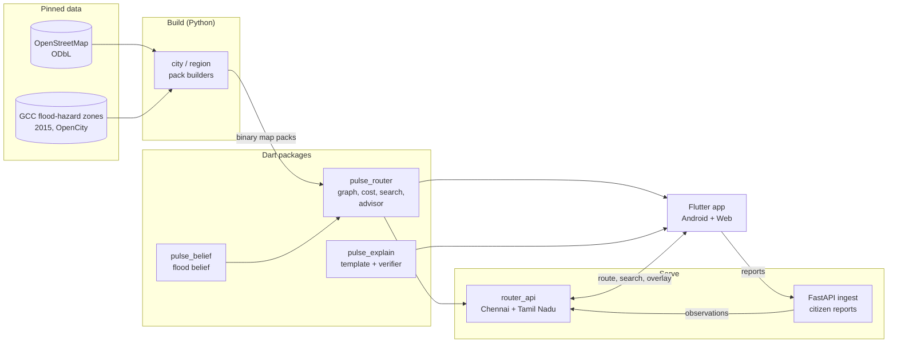
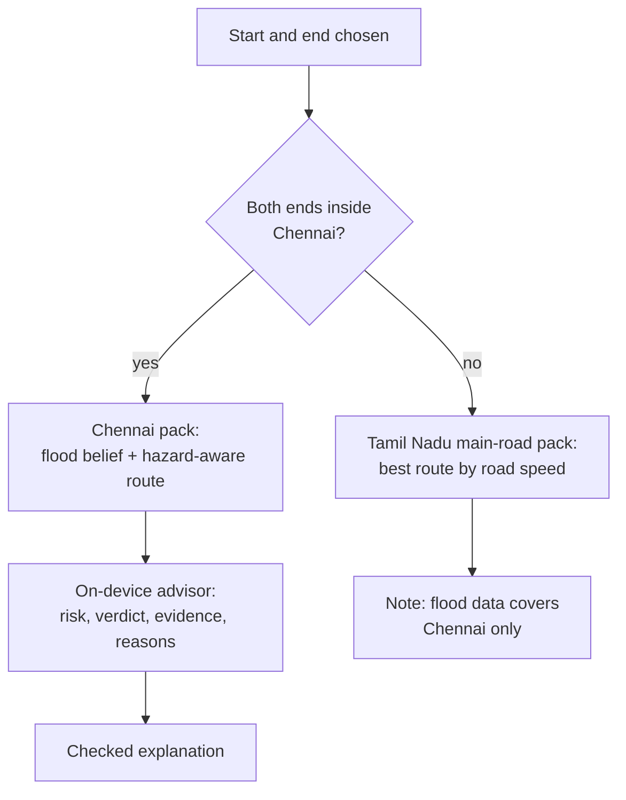

<div align="center">

# CityPulse AI

**Flood-aware, offline-first navigation for Chennai and Tamil Nadu.**
Routes on a per-street flood belief, explains every route from a checked template,
and adds a small on-device advisor that says how much to trust what it found.

[](https://github.com/Pragatish616/CITYPULSE-IDP/actions/workflows/ci.yml)


-7EBC6F)

[](LICENSE)

[Live demo](#live-demo) ·
[Overview](#overview) ·
[What it does](#what-it-does) ·
[Architecture](#architecture) ·
[Results](#what-the-evaluation-shows) ·
[Quick start](#quick-start) ·
[Repository map](#repository-map) ·
[Roadmap](#roadmap) ·
[Contributing](CONTRIBUTING.md)

</div>

> [!IMPORTANT]
> **CityPulse is a research prototype.** It estimates flood risk from limited data. It never says a road is
> safe or passable, and nothing here is a substitute for your own judgement or for official warnings.
> Flood data exists for **Chennai only**, built from 2015 records. There is no live sensor feed yet.
> The Android app has been installed and run on one phone (5 October 2026) and is reported to behave like the web app; no timings, memory figures or offline tests are recorded yet.

---

## Live demo

**Web demo, running for now: <https://citypulse-idp.onrender.com>**

Search two places in Chennai (try *Adyar* and *T. Nagar*), pick a travel mode and get a route with the advisor's verdict, or use
*Report water here* to send a test report. It is the same web app and router that this repository builds.

What to know before you try it:

- **Temporary.** It runs on a free host and may be slow, restarted or taken down without notice.
- **It sleeps.** After about 15 minutes without visitors the first page load can take 30 to 60 seconds.
- **Reports are not kept.** The report server holds them in memory, so a restart erases them. Please do not report real flooding here.
- **Not live flood data.** The flood layer is the 2015 Greater Chennai Corporation hazard map, applied as if an event were under way.
  There is no sensor feed. See the box above: it estimates risk from limited data and never says a road is safe or passable.
- **Phones.** The page is laid out for phone-sized screens. The Android app (below) has been installed on a phone and is reported to behave like this web demo.

How it is built and checked: [`docs/DEPLOY.md`](01_code/citypulse-IDP/docs/DEPLOY.md) (one container; the `Dockerfile` at the top of this repository is
generated from it). `python 01_code/citypulse-IDP/scripts/smoke_deploy.py https://citypulse-idp.onrender.com` runs 11 read-only checks against the demo.

### Android app

A manual GitHub workflow, [Android APK](.github/workflows/android-apk.yml), builds an installable app for 64-bit ARM phones (about 61 MB, signed with a debug key: for
your own phone, not the Play Store). Steps and a checklist of what to measure are in [`docs/MOBILE_TESTING.md`](01_code/citypulse-IDP/docs/MOBILE_TESTING.md).

- **Status:** built on 4 October 2026 and installed on one Android phone on 5 October 2026, where it is reported to behave like the web demo.
- **Not recorded yet:** start-up and route timings, memory, battery, and behaviour in airplane mode. In this build the router runs on the phone,
  so the offline claim is still untested. The base map needs a network for its tiles.
- Reports sent from the app go to the public demo server and are lost on its restart.

---

## Overview

Every northeast monsoon (October to December) Chennai floods in much the same places: Velachery,
Pallikaranai, the railway subways, the Mudichur corridor. Two things go wrong for people on the road.
Navigation apps optimise travel time with little street-level flood information, and connectivity fails
exactly when it is needed.

CityPulse keeps a **flood probability for every road segment**, routes on a deliberately cautious version of
it, and works without a network. It is also an honest research artifact: the repository contains the
evaluation, including the results that did **not** go our way (see [below](#what-the-evaluation-shows)).

## What it does

| Capability | How |
|---|---|
| **Per-street flood belief** | Greater Chennai Corporation hazard zones plus citizen reports that fade with age, weighted by source reliability, fused in log-odds. A Beta-posterior upper quantile gives the cautious index the router uses. |
| **Hazard-aware routing** | Bidirectional Dijkstra on a compact CSR graph. Edge cost separates *slowdown* from *harm*. Four travel modes (car, bicycle, on foot, emergency vehicle) each have their own speeds and road access. |
| **On-device route advisor** | A transparent scoring model reads the route's own facts and returns a risk level, a *proceed with care / wait / avoid* verdict, an evidence level and a route-choice check, in about 1.5 microseconds per call. See [ADR-021](01_code/citypulse-IDP/docs/DECISIONS.md). |
| **Checked explanations** | A template turns the structured decision record into text, and a symbolic verifier gates it. A language model never produces route geometry. |
| **Chennai + Tamil Nadu in one app** | A route with both ends in Chennai uses the detailed Chennai map, its flood layer and the advisor. Anything else uses a Tamil Nadu main-road map and shows only the best route. See [ADR-022](01_code/citypulse-IDP/docs/DECISIONS.md). |
| **Search** | Streets, highway numbers (`NH 44`, `NH-44`, `NH44`) and 25,144 places, in English and Tamil. |
| **Bilingual UI** | English and Tamil. The Tamil text is a first draft and needs a native speaker's review. |
| **Any city** | A pipeline builds a routing-only pack for a new city from OpenStreetMap. A hazard layer needs its own verified data source. See [Adding a city](01_code/citypulse-IDP/docs/ADDING_A_CITY.md). |

### Design rules the code enforces

- **Never say a road is safe.** No green, no "all clear", no percentages for model scores. Tests scan every UI string in both languages.
- **Absence of data is not safety.** Thin evidence pulls the advice toward *moderate*, never toward *lower risk*.
- **No invented facts.** Every number and place name in an explanation comes from the routing decision record.
- **One router.** The Dart router is the only implementation; Python re-implementations exist for analysis and are validated against it.

## Architecture



### How a route is answered



## What the evaluation shows

The point of this repository is defensible measurement, so the negative results are part of the product.

- **Crowd reports added nothing measurable** over the static hazard map on the 2015 Chennai replay. The default commuter setting changed 7 of 100 routes.
- **The first pessimistic index was broken**: it lowered caution after one weak report. It was replaced by a Beta-posterior upper quantile (ADR-015).
- **The belief is not calibrated.** The earlier model scored a *negative* Brier skill against climatology. The advisor's weights are hand-set placeholders; its outputs are scores, not measured frequencies, and there are no outcome labels to calibrate them against.
- **The scarce resource is data, not modelling.** What is missing is independent, time-stamped, street-level passability evidence.

Read the details in [`00_START_HERE/KNOWN_FLAWS.md`](00_START_HERE/KNOWN_FLAWS.md),
[`00_START_HERE/KEY_NUMBERS.md`](00_START_HERE/KEY_NUMBERS.md) and the
[decision records](01_code/citypulse-IDP/docs/DECISIONS.md) (ADR-001 to ADR-022).

## Quick start

**Requirements:** Dart 3.x, Flutter (stable) for the app, Python 3.11+ for the scripts.

```bash
git clone https://github.com/Pragatish616/CITYPULSE-IDP.git
cd CITYPULSE-IDP/01_code/citypulse-IDP

# Core packages
(cd packages/pulse_router  && dart pub get && dart test)
(cd packages/pulse_belief  && dart pub get && dart test)
(cd packages/pulse_explain && dart pub get && dart test)

# Router API (Chennai + Tamil Nadu on one port)
cd services/router_api && dart pub get
CITY=tamil_nadu PORT=8080 dart run bin/server.dart

# Flutter app (web)
cd ../../app && bash scripts/sync_data_assets.sh && flutter pub get
flutter run -d chrome --dart-define=CITY=tamil_nadu --dart-define=ROUTER_API_URL=http://localhost:8080
```

More: [Deploying](01_code/citypulse-IDP/docs/DEPLOY.md) ·
[Adding a city](01_code/citypulse-IDP/docs/ADDING_A_CITY.md) ·
[Python scripts and server](01_code/citypulse-IDP/README.md).

> The raw OpenStreetMap extract and the largest intermediate files are not in git. The map packs the app
> and server need **are** included under `01_code/citypulse-IDP/data/packs/`. See
> [`data/MANIFEST.md`](01_code/citypulse-IDP/data/MANIFEST.md) for provenance and how to rebuild.

## Repository map

```text
.
├── 00_START_HERE/        Status, known flaws (with file and line), next steps, key numbers
├── 01_code/
│   └── citypulse-IDP/    The codebase
│       ├── packages/       pulse_router · pulse_belief · pulse_explain   (Dart)
│       ├── app/            Flutter app: Android + web
│       ├── services/       router_api: Chennai + Tamil Nadu HTTP service  (Dart)
│       ├── server/         Report-ingest service                          (FastAPI)
│       ├── scripts/        Pack builders, replay engine, Study 1 and 2    (Python)
│       ├── config/         cities.yaml · hazard_classes.yaml
│       ├── data/           Pinned snapshots, map packs, results
│       └── docs/           ADRs, contracts, architecture, deployment
├── 02_paper/             IEEE conference paper (PDF + LaTeX)
├── 03_literature_review/ Review (PDF + LaTeX) and 323 verified references
├── 04_critique_and_review/  Independent review and adjudication
├── 05_council/           Believer, Skeptic, Investor, Judge verdicts
├── 06_research_notes/    Verified literature tables, market brief
├── 07_reanalysis/        Study 1 re-scored under one reference belief
├── 08_archive_v1/        Superseded drafts, kept for history
├── 09_skills/            Writing and review skills
├── docs/                 Project-wide documentation index
├── PLAN.md               Build plan and task list (M0 to M8)
└── CLAUDE.md · AGENTS.md Rules for anyone, human or agent, working here
```

## Roadmap

The full plan is [`PLAN.md`](PLAN.md); the gated next steps are in
[`00_START_HERE/NEXT_STEPS.md`](00_START_HERE/NEXT_STEPS.md).

- [x] Router, belief engine and explanation gate on the full Chennai graph
- [x] Beta-posterior pessimistic index, four travel modes, honest explanations
- [x] City-agnostic pack pipeline; Tamil Nadu main-road region
- [x] On-device route advisor; Chennai + Tamil Nadu in one app
- [x] Web demo on a free Render instance (4 October 2026); the container image is built by the host, not yet tested locally
- [x] Install and run the Android app on a real phone (5 October 2026; reported to behave like the web app)
- [ ] Measure latency, memory, battery and offline routing on the phone
- [ ] Independent, time-stamped passability data (the 15 October 2026 gate)
- [ ] Pack format v2 (32-bit name index), then detailed district packs
- [ ] Native-speaker review of the Tamil text
- [ ] Other states, one phase at a time

## Data, licences and credits

| Source | Use | Licence |
|---|---|---|
| OpenStreetMap | Roads, street and place names | ODbL 1.0 |
| Greater Chennai Corporation via OpenCity | Flood-hazard zones, 2015 reports | Public domain (one layer's origin terms still unverified) |
| OpenFreeMap / OpenMapTiles | Base map tiles | See their attribution on the map |

Provenance for every pinned file is in [`data/MANIFEST.md`](01_code/citypulse-IDP/data/MANIFEST.md).
No Google Maps Platform data is used, and the project does not bulk-use the public OpenStreetMap tile servers.

**Licence for the code:** [MIT](LICENSE). The data keeps its own licences (table above): OpenStreetMap-derived
files, including the map packs, stay under the ODbL and carry its share-alike terms.

## Contributing and conduct

Please read [CONTRIBUTING.md](CONTRIBUTING.md) first. In short: tests before changes, no invented numbers,
and use the wording rules in [`CLAUDE.md`](CLAUDE.md) section 6. Security issues go through
[SECURITY.md](SECURITY.md). We follow the [Code of Conduct](CODE_OF_CONDUCT.md).

## Team

Pragatish N · Ravi · Jyotish, B.Tech, VIT Chennai. A credited university IDP project.
