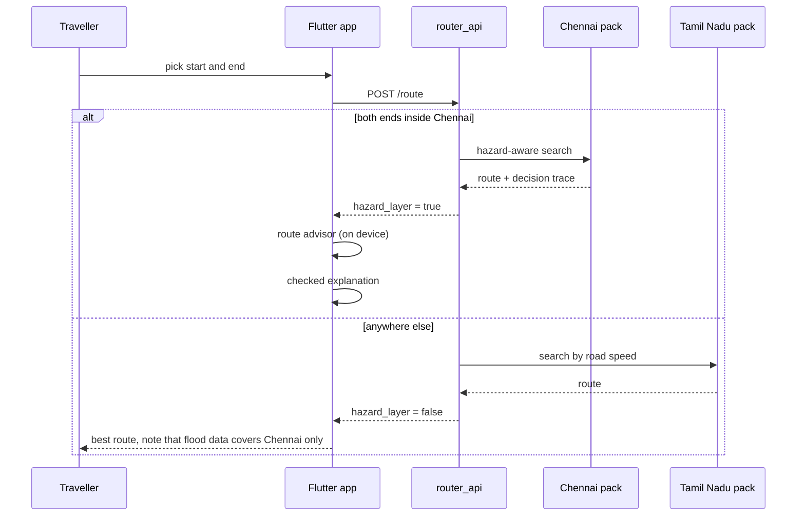

# Architecture overview

A one-page map of how CityPulse AI fits together. Component-level detail is in
[`01_code/citypulse-IDP/docs/ARCHITECTURE.md`](../01_code/citypulse-IDP/docs/ARCHITECTURE.md); the reasons behind
each choice are in the [decision records](../01_code/citypulse-IDP/docs/DECISIONS.md).

## Components

| Component | Language | Role |
|---|---|---|
| `pulse_belief` | Dart | Fuses the static hazard prior and citizen reports into a flood probability per street, with source weights and time decay |
| `pulse_router` | Dart | Map pack reader, bidirectional Dijkstra, hazard-aware edge cost, travel profiles, decision trace, place search, route advisor |
| `pulse_explain` | Dart | Template explanation from the decision trace, and the symbolic verifier that gates any text |
| `router_api` | Dart | HTTP service: routes, search, hazard overlay, event state, optional cloud-rewrite proxy. Serves Chennai and Tamil Nadu together |
| Flutter app | Dart | Android and web client; the same code in both |
| Ingest server | Python (FastAPI) | Accepts citizen reports, serves observations |
| Pipelines | Python | Build binary map packs from OpenStreetMap; replay engine and studies |

One router implementation, two consumers: the Flutter app imports the Dart package directly, and the Python
harness calls its compiled command-line build. Nothing is re-implemented for production.

## The model

For street `e` at time `t`, evidence is fused in log-odds with a per-class decay, and the router uses a
Beta-posterior upper quantile as its cautious index `p̃` (ADR-015). The edge cost keeps slowdown and harm apart:

```text
w(e,t) = τ0 · [1 + p̃ · (δ − 1)]  +  λ · p̃ · s · τ0
```

`τ0` is free-flow time, `δ` the depth-based slowdown (1 when depth is unknown, which is always today), `λ` a
per-traveller weight and `s` a severity. Because every term only adds cost, the hazard cost is never below
free-flow time, which keeps landmark-based speed-ups admissible if they are ever put on the query path.

## Data flow



## Where things live

- **Map packs** are binary files (`graph.bin`, `nodes.bin`, `meta.bin`) plus a place list, under
  `01_code/citypulse-IDP/data/packs/`. They are built from OpenStreetMap by `scripts/build_packs.py`,
  `scripts/city_pipeline.py` and `scripts/region_pack.py`.
- **Regions** are declared in `config/cities.yaml`: bounding box, pack folder, snap radius, opening zoom,
  whether a flood layer exists, and which detailed cities sit inside (`detail_regions`).
- **Travel modes and hazard classes** are in `config/hazard_classes.yaml`; every number there is a placeholder
  assumption until measured.

## Honest status

TRL 4 for the router and belief engine on a deterministic replay, TRL 3 for the system as a whole. The Android app has
been installed and run on one phone (unmeasured, offline use untested), and the Chennai flood layer is built from 2015 records. See
[`00_START_HERE/PROJECT_STATUS.md`](../00_START_HERE/PROJECT_STATUS.md).
